# Blockchain & Crypto Theory: A Technical PM's Guide

**Reading Time:** ~40 minutes
**Audience:** Technical Product Managers
**Updated:** January 2026

---

## What's in this Document

This guide covers the foundational theory PMs need to understand blockchain, crypto, and DeFi:

- **Blockchain Fundamentals**: Distributed ledgers, immutability, consensus, and why decentralization matters
- **Consensus Mechanisms**: Deep dive into Proof of Work (Bitcoin), Proof of Stake (Ethereum), and Proof of History (Solana) with real execution examples
- **DeFi Primitives**: AMMs (automated market makers), concentrated liquidity, liquid staking, and staking mechanics with technical walkthroughs
- **Crypto Activities & Strategies**: Practical guides to staking, yield farming, trading, and leverage with real numbers and risk disclosure
- **Quick Reference**: Comparison tables for Bitcoin/Ethereum/Solana and decision frameworks for when to use which blockchain

**Key distinction**: This document prioritizes **accurate technical explanation** over marketing claims. When Solana is "better" at something, we explain why with specifics. When it's just "different," we say so. When there are tradeoffs, we acknowledge them.

---

## Quick Acronym Reference

| Acronym | Expansion |
|---------|-----------|
| **AMM** | Automated Market Maker |
| **APY** | Annual Percentage Yield |
| **APR** | Annual Percentage Rate |
| **CEX** | Centralized Exchange |
| **DAO** | Distributed Autonomous Organization |
| **DEX** | Decentralized Exchange |
| **IL** | Impermanent Loss |
| **LP** | Liquidity Provider |
| **LST** | Liquid Staking Token |
| **MEV** | Maximal Extractable Value |
| **PoH** | Proof of History |
| **PoS** | Proof of Stake |
| **PoW** | Proof of Work |
| **TVL** | Total Value Locked |
| **VDF** | Verifiable Delay Function |

## Table of Contents

1. [Blockchain Fundamentals](#blockchain-fundamentals)
2. [Consensus Mechanisms](#consensus-mechanisms)
3. [DeFi Primitives](#defi-primitives)
4. [Crypto Activities & Strategies](#crypto-activities--strategies)
5. [Quick Reference](#quick-reference)

---

## Blockchain Fundamentals

### What is a Blockchain?

**Simple Analogy:** Imagine a ledger (accounting book) that:
- Multiple people maintain independently (distributed)
- No one can erase past entries (immutable)
- New entries are verified by the group before adding (consensus)
- Everyone has an identical copy (decentralized)

If someone tries to cheat by changing an old entry, everyone else's copies would show the tampering. The fraudster would need to simultaneously change the majority's copies—mathematically impractical.

**Technical Reality:**
A blockchain is a linked list of "blocks," where each block contains:
- Transactions (data)
- A cryptographic hash (unique fingerprint)
- The previous block's hash (creates the chain)
- A timestamp

```
Block 1                Block 2                Block 3
├─ Txn A              ├─ Txn D              ├─ Txn G
├─ Txn B              ├─ Txn E              ├─ Txn H
├─ Txn C              ├─ Txn F              └─ Hash: 7F9A2...
├─ Hash: 3B4E1...     └─ Hash: 5C8D2...         ↑
└─ Prev: 0000...          ↑                     └─ (references Block 2's hash)
                        (references Block 1's hash)
```

### Why Cryptography Matters

**Hashing (One-Way Function):**
- Input: "Hello World" → Output: 5EB63BBBE01EEED...
- Same input always produces same hash
- Change one character → completely different hash
- Impossible to reverse (can't deduce input from hash)

**Digital Signatures (Proof of Ownership):**
- Public Key: Your account address (visible to everyone)
- Private Key: Secret password (only you know)
- When you sign a transaction: Private key proves you authorized it without revealing the key
- Analogy: Like signing a check—verifies you authorized it without giving away your signature

**This enables:** Anyone can verify you authorized a transaction without trusting you personally.

---

## Consensus Mechanisms

The core problem consensus solves: **How do distributed participants agree on truth without a central authority?**

### Proof of Work (PoW) - Bitcoin's Model

#### The Setup: A Very Dumb But Very Expensive Lottery

Imagine this: Bitcoin is like a lottery, but instead of picking lucky numbers, miners are doing billions of pointless calculations.

**What the miner has:**
- A block of pending transactions (e.g., Alice → Bob: 0.1 BTC, Charlie → Dana: 0.3 BTC, etc.)
- A block header containing:
  - Hash of the previous block (links the chain)
  - Timestamp
  - A nonce (a random number miners twist to try different combinations)

**The rule (this is the "work" part):**
Bitcoin says: "Find a hash of this block that starts with a certain number of zeros."

Example target (simplified):
```
000000000000000xxxxxxxxxxxxxxxxxxxxxxxxxxxxxxxxxxxx
```

**Important:**
- Hash = SHA-256 (one-way, unpredictable—no formula exists)
- You cannot calculate the right nonce
- You can only guess and check, billions of times per second

#### The Loop: What Miners Actually Do

```
Miner sets nonce = 1
Hashes the block → 9f3a7c1e... ❌ (doesn't start with enough zeros)

Miner sets nonce = 2
Hashes again → a41b92dd... ❌

Miner does this billions of times per second:
nonce = 18,392,884,113
hash = 0000000000000008af3c91... ✅

🎉 Winner. Stop.
```

#### What Happens When a Miner Wins

**The miner:**
1. Broadcasts the block + winning hash to the network
2. Receives the block reward (~3.125 BTC) + transaction fees

**Other nodes:**
1. Verify the hash in seconds (cheap to check)
2. Agree: "Yep, that hash is valid"
3. Add block to their copy of the chain

#### Why This Secures Bitcoin: The Key Insight

To cheat (e.g., rewrite transaction history), an attacker would have to:

1. Redo the Proof of Work for this block
2. AND redo it for every block after it
3. Faster than the rest of the world combined

**That means:**
- Insane hardware investment (millions of dollars)
- Insane electricity cost (hundreds of millions daily)
- And still probably fail

💡 **Truth bomb:** Proof of Work doesn't stop cheating by rules—it stops cheating by making it **financial suicide**.

#### Energy Economics

**2025 Reality:**
- Bitcoin mining consumes ~211.58 TWh annually (0.83% of global electricity)
- Equivalent to Thailand's or Vietnam's entire electricity consumption
- BUT: 52.4% comes from renewable energy (42.6% renewable + 9.8% nuclear)
- **Comparison to other chains**: Ethereum (post-PoS) uses ~0.01 TWh annually—Bitcoin uses roughly **21,000x MORE energy** than Ethereum since Ethereum's 2022 transition to Proof of Stake

**Why so energy-intensive?**
The security comes from computational cost. To attack Bitcoin, attackers would need:
- 51% of mining hashrate (combined computer power)
- Requires purchasing/renting millions of specialized computers
- Daily electricity costs: hundreds of millions of dollars
- Economic infeasibility makes the network secure

#### Strengths & Weaknesses

| Aspect | Details |
|--------|---------|
| **Security** | Proven for 16+ years. Attack cost is astronomical. |
| **Decentralization** | Anyone with hardware can participate. High barrier to entry but distributed. |
| **Finality** | Probabilistic finality: 1 block ≈ 10 min. 6 confirmations (~60 min) assumed "final" but not absolute. Additional blocks reduce reversal probability exponentially. |
| **Energy** | Massive consumption. Climate concerns legitimate. |
| **Scalability** | Limited by block time (10 min) and size (1MB). Bitcoin: ~7 TPS. |

---

### Proof of Stake (PoS) - Ethereum's Model

#### The Setup: A Lottery Where You Risk Your Own Money

This is the opposite of PoW. Instead of wasting electricity, you put up collateral (your own money).

**What a validator has:**
- 32 ETH (~$100K) locked as collateral in a smart contract
- Ability to propose blocks and vote on their validity
- The risk: Misbehave, and you lose your ETH (slashing)

**The rule (this is the "stake" part):**
Ethereum says: "Validators with more stake have higher probability of being selected to propose the next block. But we'll randomize it so you can't predict who's next."

**Important:**
- Selection is stake-weighted (1,000 ETH → 100x more likely than 10 ETH)
- But not deterministic (you can't guarantee you'll propose next)
- Validators earn rewards for honest behavior, lose stake for dishonest behavior

#### The Loop: What Validators Actually Do

```
Slot 1 (12 seconds):
- Validator 2,847 is randomly selected as "proposer"
- They collect pending transactions into a block
- They broadcast: "Here's my proposed block" ✅

Other 1,000,000 validators:
- Check: "Is this block valid?" (takes ~1 second)
- Vote: "Yes, I attest this is valid" or "No, something's wrong"
- ~2/3 of validators attest = block is finalized ✅

Validator 2,847:
- Receives block reward (~0.03 ETH) + transaction fees
- Their stake: still safe (they behaved honestly)

🎉 Block added to chain. Next slot begins.
```

**If a validator misbehaves:**

```
Validator 2,847 tries to cheat:
- Proposes two different blocks at slot 1 (equivocation)
- Network detects contradiction

Punishment:
- 1% of their stake removed (at minimum)
- If many validators cheat simultaneously, penalty up to 100%
- Example: 32 ETH → 31.68 ETH gone (misbehavior caught early)

Reality check:
- Sept 2025: 39 validators slashed in one event
- Total loss: Several million dollars
```

#### What Happens When a Validator Wins the Lottery

**The validator:**
1. Gets selected (proportional to stake, but random)
2. Proposes a block with pending transactions
3. Other validators check and attest it's valid
4. Receives the block reward (~0.03 ETH) + transaction fees

**Other validators:**
1. Check the proposed block in ~1 second (cheap)
2. Vote (attest): "I agree this is valid"
3. ~2/3 agreement = block is finalized
4. Stake remains safe (they behaved honestly)

#### Why This Secures Ethereum: The Key Insight

To cheat (e.g., rewrite transaction history), an attacker would have to:

1. Control 51% of all staked ETH
2. Without being detected (validators monitor each other)
3. Even if undetected, slashing would destroy their collateral
4. Worse than cheating: If detected during attack, lose 100% of stake

**That means:**
- Need ~$15B in ETH (51% of ~$29B total staked)
- Slashing penalty = automatic confiscation
- Market knows you cheated → ETH value crashes → you lose money twice

💡 **Truth bomb:** Proof of Stake doesn't stop cheating by difficulty—it stops cheating by making it **economically suicidal AND automatic**.

#### Validator Rewards (2025 Data)

**Economics:**
- Average APY (Annual Percentage Yield): 3.2% (declining trend)
- If validator earns 3% on 32 ETH: +0.96 ETH/year (~$3,100)
- Fee: Network transaction fees added on top
- Trend: Rewards declining as more validators join (share the pie)

**Market Structure:**
- **Solo stakers** (<1%): 32 ETH deposit yourself, run validator software
- **Staking pools** (17.7%): Aggregate capital, earn pooled rewards minus commission
- **Liquid staking** (31.1%): Deposit assets → receive LST (stETH, etc.) → stake elsewhere
- **Top players**: Lido (47% of liquid staking market), Binance, Rocket Pool

#### Liquid Staking Decoded (with zero crypto mysticism)

**What "Liquid staking (31.1%)" actually means:**

31% of all staked ETH is staked in a way where people **don't lock their money**—they keep it *liquid*.

Normally, staking = "lock it, don't touch it for months."
Liquid staking says: *nah, have a receipt you can reuse*.

---

**Step 1: You deposit ETH**

You give 10 ETH to a liquid staking protocol (most famously Lido).

```
You have:    10 ETH
You give:    10 ETH to Lido
```

---

**Step 2: You receive an LST (Liquid Staking Token)**

In return, you get a **tokenized receipt** called stETH.

```
10 ETH deposited → you receive ~10 stETH
```

**stETH = "staked ETH receipt"** that represents:
- Your original 10 ETH
- Plus staking rewards over time (auto-compounding)

**Important:** Your ETH is **actively staking** and earning 3.2% APY, but **you're not stuck**.

---

**Step 3: You "stake elsewhere" (this is the magic)**

You take your stETH receipt and:
- Lend it to a lending protocol
- Use it as collateral for loans
- Deposit it in a DEX as liquidity
- Earn *additional* yield on top

So you're earning:
1. **Staking rewards** (3.2% from Ethereum validation)
2. **DeFi yield** (5-15% from whatever you do with stETH)
3. **Total**: Stack your yields

This is why 31% of stakers use liquid staking—you don't lose liquidity.

---

**Simple analogy (this makes it click):**

Imagine:
- You deposit **gold** into a vault
- Vault gives you a **gold receipt** (stETH)
- Gold stays locked and earns interest
- But you still hold the receipt and can:
  - Trade it
  - Borrow against it
  - Use it to earn more money elsewhere

**That receipt = your LST.**

---

**Comparison: Solo Staking vs Liquid Staking**

| Aspect | **Solo Staking** | **Liquid Staking** |
|--------|-----------------|-------------------|
| **Deposit** | 32 ETH (~$100K) | Any amount (e.g., 1 ETH) |
| **Liquidity** | Locked (can't touch) | Liquid (can trade/use) |
| **Earnings** | 3.2% APY (staking only) | 3.2% + additional DeFi yield |
| **Effort** | Run validator software | Just hold stETH |
| **Risk** | Slashing + operational | Smart contract risk + depeg risk |
| **% of stakers** | <1% | 31.1% (and growing) |

**Why people choose liquid staking:**
- ✅ Don't lose spending power
- ✅ Can stack yields
- ✅ No technical expertise needed
- ❌ Depend on smart contracts (hack risk)
- ❌ LST can slightly depeg from ETH in stress events
- ❌ Lido's dominance (47% of all liquid staking) is centralization risk

💡 **One-sentence summary:** Liquid staking lets you stake ETH *and* keep its spending power by giving you a tradable receipt (LST) that you can reuse elsewhere.

#### Slashing: Punishment for Bad Behavior

**What Gets You Slashed:**
1. **Equivocation**: Proposing multiple blocks at same height (two different versions)
2. **Attestation violation**: Voting contradictory messages about block validity

**Penalty Tiers:**
- **Minor violation**: 1% of stake removed
- **Major violation**: Cascading penalty up to 100% (if many validators slashed simultaneously)

**Real Event (September 2025):**
- 39 validators slashed in largest correlated event since Ethereum's PoS launch
- Root cause: Third-party staking infrastructure (SSV Network) had configuration issues
- This demonstrates: Risk exists even when individual validators behave correctly

#### Strengths & Weaknesses

| Aspect | Details |
|--------|---------|
| **Energy** | 0.01% of PoW energy. ~$2,700/year per validator vs millions for PoW. |
| **Accessibility** | 32 ETH barrier, but staking pools democratize access. |
| **Capital Efficiency** | Deposit = long-term commitment. Earning rewards, not wasting electricity. |
| **Slashing Risk** | Validator must trust their infrastructure (client software, hardware). |
| **Finality** | Faster than PoW (~12 seconds per slot, not ~10 minutes). |
| **Scalability** | Limited by validator count, not electricity. Ethereum targets ~10K validators. |

---

### Proof of History (PoH) - Solana's Innovation

#### The Setup: A Cryptographic Timestamp, Not a Lottery

This is radically different from PoW and PoS. Instead of "who gets to propose the next block?", PoH says: "Let's make time itself part of the blockchain."

**What the validator has:**
- Pending transactions from the network
- A powerful hash function (SHA-256)
- No special rights (yet—just the ability to propose)
- A slot (400 milliseconds) to do this

**The rule (this is the "proof of history" part):**
Solana says: "The leader continuously hashes the most recent state with incoming transactions, creating a sequential chain of hashes (H₀ → H₁ → H₂...). This produces ~4 billion sequential hashes per 400ms slot. Each transaction is cryptographically anchored at a specific hash index. If you try to reorder a transaction, the hash sequence from that point onward becomes invalid. Everyone can verify this immediately. You can't reorder transactions without redoing all subsequent hashes."

**Important:**
- This is NOT a lottery—it's deterministic sequencing
- The hashing takes ~400ms (unavoidable)
- But once done, the sequence is cryptographically **permanent**
- You cannot insert a transaction "between" two existing ones without redoing everything after

#### The Loop: What the Leader Actually Does

```
Leader receives pending transactions at slot 1000:
- Txn A: Alice → Bob: 1 SOL
- Txn B: Charlie → Dana: 2 SOL
- Txn C: Eve → Frank: 0.5 SOL

Leader applies Verifiable Delay Function (VDF):
- Hash(state + Txn A) = 0x8f2a1... (timestamp = 1000.0ms)
- Hash(0x8f2a1... + Txn B) = 0x3c4b7... (timestamp = 1000.1ms)
- Hash(0x3c4b7... + Txn C) = 0x5e9d2... (timestamp = 1000.2ms)

Broadcasts: "Block with sequence: A → B → C, hashes: 8f2a1 → 3c4b7 → 5e9d2" ✅

Other validators verify (takes milliseconds):
- "Let me hash the same inputs with VDF..."
- "Yep, the sequence matches. Block is valid." ✅

🎉 Block added to chain instantly (no voting needed).
```

**If someone tries to cheat:**

```
Attacker tries to insert Transaction X between A and B:
- Would need: Hash(0x8f2a1... + Txn X) = new intermediate hash
- Then: Hash(new_intermediate + Txn B) = different hash than 0x3c4b7...
- But then: Hash(different + Txn C) = different than 0x5e9d2...
- And every block AFTER this one would have different hashes
- Network would immediately detect: "Your hashes don't match!" ❌

The entire chain history would need to be rewritten.
```

#### Key Innovation: Verifiable Delay Function (VDF)

**Why is VDF clever?**

- **Computational cost**: ~4 billion SHA-256 hashes (can't skip, takes ~400ms)
- **Verification speed**: Takes milliseconds to verify the result is correct
- **No pre-computation**: You can't guess future timestamps (VDF is sequential)
- **Unpredictable output**: Even if you know the inputs, the hash is random

Real analogy:
- **PoW**: "Guess until you find the magic number"
- **PoS**: "Bet your money you're honest"
- **PoH**: "Here's a tamper-proof timestamp. Good luck changing it without redo-ing everything."

#### What Happens When a Leader Proposes a Block

**The leader:**
1. Gets selected for slot (rotation schedule, not lottery)
2. Receives pending transactions (400ms window)
3. Applies VDF to create permanent sequence
4. Broadcasts block with sequence proof
5. Receives validator rewards (~0.03 SOL) + transaction fees

**Other validators:**
1. Verify the VDF sequence (milliseconds)
2. Agree: "Yes, this sequence is valid"
3. Block is added to slot; finality achieved via stake-weighted voting (~20-40 seconds for absolute economic finality; ~1-2 seconds for practical safety via confirmed commitment level)
4. Move to next slot

#### Why This Secures Solana: The Key Insight

To cheat (e.g., reorder transactions), an attacker would have to:

1. Recompute all PoH hashes from the attack point forward
2. Do it faster than the rest of the network (which is still moving forward)
3. Convince the network their chain is the "real" one

**That means:**
- Need 51% of network validation power (like PoS)
- PLUS massive computational power to recompute PoH hashes
- PLUS do it all faster than the honest network
- Even then, longest chain always wins

💡 **Truth bomb:** Proof of History doesn't stop cheating by electricity OR collateral—it stops cheating by making **rewriting the past computationally impossible before the future arrives**.

#### Proof of History Decoded: How Solana Really Works

**Key insight:** Solana combines PoS (who may speak) + PoH (in what order they spoke) + Ledger rules (what's actually true).

---

#### The Two Roles (PoS + PoH Working Together)

**Leader** (selected by PoS)
- Selected in advance via Proof of Stake
- Controls a very short slot (~400ms)
- **Responsibility**: Order transactions and stream them into PoH hash sequence
- **Decision**: "In what order did transactions arrive?"
- **Leader does NOT decide**: whether transactions are valid

**Validators** (all other nodes)
- **Responsibility 1**: Replay the PoH hash sequence
- **Responsibility 2**: Replay transactions in that exact order
- **Responsibility 3**: Enforce ledger rules (balances, signatures, program logic)
- **Responsibility 4**: Vote on the resulting state
- **Decision**: "Which transactions actually succeed?"
- **Validators DO decide**: truth

---

#### Where PoS and PoH Fit (The Division of Labor)

**PoS → who is allowed to produce blocks and vote** (Proof of Stake selects the leader)

**PoH → in what order transactions are attempted** (Proof of History proves sequence)

**Ledger rules → which transactions actually succeed** (Validators enforce the rules)

**Important:** PoH does not replace PoS. PoH removes the need to coordinate on time.

Instead of:
- "Hey validators, did we all receive transactions in this order?"
- "Hmm, I'm not sure... let me ask the others..."
- "Wait, some people got different orders..."

Solana says:
- Leader hashes them in order
- Hashes prove the order
- Everyone replays the same sequence
- No debate. No coordination. No slow consensus rounds.

---

#### The Cryptographic Clock: Proof of History

PoH is based on a **sequential hash function that cannot be sped up or parallelized**.

**Hash sequence (mathematical proof of elapsed time):**

```
H₀ = seed (starting point)
H₁ = SHA-256(H₀)
H₂ = SHA-256(H₁)
H₃ = SHA-256(H₂)
H₄ = SHA-256(H₃)
...
H₁₀,₀₀₀,₀₀₀ = SHA-256(H₉,₉₉₉,₉₉₉)
```

**Properties:**

- **Sequential**: You must compute every step in order. Can't skip H₂ and jump to H₄.
- **Time-enforcing**: If H₄ exists, then H₁, H₂, H₃ MUST have been computed before it.
- **Cheap to verify**: Anyone can replay and check instantly.

💡 **This turns time into math.** No clock needed. No trust needed. Just cryptography.

---

#### How Transactions Get Ordered (The Leader's Job)

The leader continuously computes the hash chain while transactions arrive and anchors each transaction into it.

**Example:**

```
Tx A arrives → anchored at H₂
Tx B arrives → anchored at H₄
Tx C arrives → anchored at H₆
```

This cryptographically proves:
- Tx A happened before Tx B (H₂ before H₄)
- Tx B happened before Tx C (H₄ before H₆)
- Leader could NOT backdate or reorder (would need to recompute entire hash sequence)

Validators later replay:
```
H₀ → H₁ → H₂ → H₃ → H₄ → H₅ → H₆ → ...
               ↑              ↑
              Tx A           Tx B
```

**No timestamps. No debates. Just math.**

---

#### End-to-End Execution Example (Real Scenario)

Let's watch PoS + PoH + Ledger rules work together on actual transactions.

**Initial state (before any transactions):**

```
Alice   = 100 SOL
Bob     = 10 SOL
Charlie = 50 SOL
Diana   = 0 SOL
```

**Transactions that arrive at the leader (in this order):**

```
1. Charlie → Diana: 25 SOL  (arrives at H₁₀₀)
2. Bob → Diana: 15 SOL       (arrives at H₂₀₀)
3. Alice → Bob: 20 SOL       (arrives at H₃₀₀)
```

Each Hₙ is a PoH hash—cryptographic proof that time passed in this order.

---

**Validators replay and enforce ledger rules:**

```
Transaction 1: Charlie → Diana (25 SOL)
├─ Attached at H₁₀₀
├─ Charlie has 50 SOL ✅
├─ 50 ≥ 25 ✅
└─ Result: ✅ VALID

  Charlie = 50 - 25 = 25 SOL
  Diana   = 0 + 25  = 25 SOL
```

```
Transaction 2: Bob → Diana (15 SOL)
├─ Attached at H₂₀₀
├─ Bob has 10 SOL ❌
├─ 10 < 15 ❌
└─ Result: ❌ INVALID (insufficient balance)

  State does NOT change
  Bob   = 10 SOL (unchanged)
  Diana = 25 SOL (unchanged)

  Block continues (failed txns included but have no effect)
```

```
Transaction 3: Alice → Bob (20 SOL)
├─ Attached at H₃₀₀
├─ Alice has 100 SOL ✅
├─ 100 ≥ 20 ✅
└─ Result: ✅ VALID

  Alice = 100 - 20 = 80 SOL
  Bob   = 10 + 20  = 30 SOL
```

---

**Final canonical state (after all validators replay):**

```
Alice   = 80 SOL
Bob     = 30 SOL
Charlie = 25 SOL
Diana   = 25 SOL
```

**Note:** Transaction 2 (Bob → Diana: 15 SOL) failed and had no effect. But it's still recorded in the block. Validators can see what happened, why it failed, and that the ledger is still valid.

---

#### Why Proof of History is Needed (The Speed Win)

Even though failed transactions are allowed (they don't break anything), validators still need:

1. **One exact ordering** (no arguing about which transaction came first)
2. **No timestamp negotiation** (no "what time do you think it happened?")
3. **No extra consensus rounds** (no voting on ordering)

PoH replaces:
- ❌ "Let's all agree on what came first" (consensus needed, slow)
- ✅ "Here is cryptographic proof of what came first" (instant, no voting)

**PoH is a performance optimization layer, not a trust assumption.**

---

#### The Mental Model (Keep This)

```
PoS decides who may speak.
PoH proves the order of speech.
Validators enforce reality.
Everything else is implementation detail.
```

---

**Why Proof of History is powerful:**

- ✅ **Finality is fast** (~20-40 seconds via stake-weighted voting; practical safety ~1-2 seconds via confirmed commitment level; block inclusion ~400ms)
- ✅ **No voting overhead** (just verify hashes, takes milliseconds)
- ✅ **Sequence is cryptographically permanent** (can't reorder without hashes breaking)
- ✅ **Enables 65K+ TPS** (no coordination overhead)
- ❌ Requires quality validators to be distributed (800 vs 1M+)
- ❌ Relatively new (less battle-tested than PoW/PoS)

💡 **One-sentence summary:** Proof of History lets the leader cryptographically prove the order of transactions using an unforgeable hash sequence, so validators don't need to negotiate or vote on timing.

#### Why This Matters for Product

**UX Impact:**
- Transactions appear in block within 400ms (slot time); economically finalized within ~20-40 seconds (stake-weighted voting); practically safe for most uses within ~1-2 seconds (confirmed commitment level)
- Quick block inclusion (400ms); finality via stake-weighted voting (~20-40 seconds)
- Suitable for retail trading, payments, real-time applications
- User experience feels instant

**Cost Impact:**
- Lower validator requirements (less electricity, cheaper hardware)
- Smaller block space doesn't mean fewer transactions (parallel execution possible)
- Lower transaction fees sustainable at scale
- Better economics for Solflare's users

#### Strengths & Weaknesses

| Aspect | Details |
|--------|---------|
| **Speed** | 400ms block/slot time; ~20-40s economic finality; ~1-2s practical safety. Enables real-time applications. |
| **Energy** | Hybrid with PoS = minimal energy. |
| **Scalability** | 65K+ TPS. Built-in capacity for ecosystem growth. |
| **Complexity** | VDF mechanism harder to understand than PoW/PoS. |
| **Validator Consolidation** | Requires quality validators (not commodity). Fewer validators (800 vs. 1M+). |
| **Novelty** | Only ~5 years live. Less battle-tested than PoW/PoS. |

---

## The Three Mechanisms in Plain English

**If you had to explain each to your mom:**

**Proof of Work (Bitcoin):**
"People use super-expensive computers to solve puzzles. Whoever solves it first gets money. If you try to cheat, you'd need more computers than everyone else combined—which costs way more than you could ever steal. So nobody cheats."

**Proof of Stake (Ethereum):**
"People lock up their money as collateral, like posting bail. The network picks one person to propose the next block. If they're honest, they keep their money + get a reward. If they cheat, their money gets taken automatically. So it's cheaper than PoW, but you lose everything if you misbehave."

**Proof of History (Solana):**
"A leader creates a tamper-proof ordering by continuously hashing transaction data sequentially (~4 billion hashes per 400ms slot). Each transaction is cryptographically anchored at a specific hash index. If you try to insert a transaction out of order, the hash sequence from that point onward becomes invalid. Everyone can verify this immediately. You can't reorder transactions without redoing all subsequent hashes, and by then the network has moved on."

---

## DeFi Primitives

### Liquidity Providing (LP) - The Engine of DEXs

#### Core Mechanism

**Analogy:** You're a market-maker at a casino:
- Customers come to buy/sell chips
- You buy low, sell high
- Take a spread on each transaction
- Capital is tied up (you can't use it elsewhere)
- If one chip value crashes, you're stuck holding depreciated chips

**Reality in DeFi:**
- You deposit two assets (e.g., ETH and USDC) in equal value
- Traders execute swaps against your pool
- You earn a percentage of swap fees (typically 0.01%-1%)
- Risk: If prices diverge, you may have imbalanced holdings

#### Traditional AMM - Automated Market Maker (Uniswap v2)

```mermaid
graph TB
    A["LP Deposits<br/>$10K ETH + $10K USDC"] -->|Pool Created| B["x × y = k<br/>Pool Balance"]
    B -->|Trader Swaps| C["1 ETH → 1,500 USDC"]
    C -->|Pool Updates| D["Slightly less<br/>ETH, more USDC"]
    D -->|Fee| E["LP Earns<br/>0.3% of Swap"]
    E -->|Price Diverges| F["LP Vulnerable to<br/>Impermanent Loss"]
```



**How the Math Works:**
- Pool formula: x × y = k (where x = ETH amount, y = USDC amount, k = constant)
- Trader wants 1 ETH, must provide enough USDC to keep product constant
- If pool has 100 ETH & 150K USDC:
  - x × y = 15M
  - Trader removes 1 ETH (99 × y = 15M)
  - y = 151,515 USDC
  - Trader pays: 1,515 USDC for 1 ETH (more than fair price)
  - LP earns: Difference from fair price

#### Concentrated Liquidity (Uniswap v3+)

**Problem with v2:** Your capital spread across $0 to $∞ price range. Most capital sits unused.
- ETH/USDC trading between 1,500-2,000 USDC
- Your capital allocated for 0-100 and 5,000-∞ sits idle
- Less fees earned per dollar deployed

**Solution:** Concentrate capital to likely price ranges.


**Trade-offs:**
- **Higher returns**: If price stays in your range, earn 4000x more fees
- **Liquidation risk**: If price exits your range, position becomes inactive (earn no fees)
- **Active management**: Must adjust ranges as market moves

**Real Numbers (2025):**
- Stablecoin pair (USDC/USDT): Liquidity concentrated to 0.99-1.01 range
- Same $100K capital: v2 earns ~$50/day, v3 earns ~$200,000/day (during bull market)
- Trade-off: If stablecoin depegs, position sits idle

#### Impermanent Loss (IL)

**Scenario:**
- You deposit 1 ETH ($2,000) + 2,000 USDC ($2,000)
- ETH price jumps to $4,000
- You must provide more ETH to your pool (AMM math)
- If you withdraw now: 0.7 ETH + 2,800 USDC = $5,600
- If you'd held separately: 1 ETH + 2,000 USDC = $6,000
- **Loss: $400 (IL from price divergence)**

**Why It Happens:**
The AMM forces you to sell high and buy low. Sounds good, but you're selling into your own pool, not the market. If price keeps rising, you regret providing liquidity.

**Mitigation:**
- LP fees must exceed IL (earn 2% fees on $4K transactions before IL hurts)
- Concentrated liquidity: Higher fee rates in tighter ranges
- Stable pairs: ETH/USDC, USDC/USDT have predictable price ranges (less IL)

---

### Staking - Securing the Network

#### Solo Staking (Ethereum)

**How It Works:**
1. Deposit 32 ETH to official Ethereum Launchpad
2. Run validator client (Prysm, Lighthouse, Nimbus, Teku)
3. Client connects to the Ethereum network
4. Validator participates in consensus
5. Earn fees + rewards (~3.2% APY)
6. Must keep validator online (offline = penalties)

**Requirements:**
- **Capital**: 32 ETH (~$100,000) minimum
- **Hardware**: Standard computer or modest server (~$500-$2,000)
- **Technical**: Comfortable with Linux/command line
- **Commitment**: Long-term (staked ETH currently locked; future unlock planned)

**Risk Profile:**
- Slashing risk: 1% per violation, up to 100% for major violations
- Operational risk: If validator is offline, earn 0% for those periods
- Capital risk: 32 ETH is a large commitment

**Market Reality (2025):**
- Only <1% of staking ETH is from solo stakers
- Most activity in staking pools and liquid staking

#### Staking Pools

**Advantage:** Fractional participation (stake any amount, not 32 ETH minimum)

**How It Works:**
1. You deposit ETH to staking pool (e.g., Rocket Pool)
2. Pool aggregates many deposits
3. Pool runs multiple validators
4. You earn proportional share of rewards
5. Pool takes commission (5-15% typically)

**Example:**
- You deposit 1 ETH
- Pool allocates portion to validator 1, validator 2, etc.
- Validators earn 3.2% APY
- Pool takes 10% commission
- You earn: ~2.88% APY

**Benefits vs Solo:**
- Lower capital barrier
- Reduced variance (one bad validator doesn't hurt much)
- Professional infrastructure
- Liquid staking option available (receive LST)

#### Liquid Staking Tokens (LSTs)

**Problem:** Staked ETH is locked. Can't use it elsewhere.

**Solution:** Deposit ETH → Receive LST → Use LST in DeFi → Still earning staking rewards


**Market Reality (2025):**
- Liquid staking dominates: 31.1% of staked ETH (10.53M ETH)
- Solo stakers: <1% of market
- Market leaders: Lido (dominant), Binance Staked ETH, Rocket Pool

**Why LSTs Matter for PMs:**
- Unlock capital productivity (don't choose between yield and liquidity)
- Gateway to DeFi for retail users ("passive income + active trading")
- Competitive advantage for wallets (Solflare Card, Jupiter Lend, etc.)

---

### Staking on Solana - Different Model

#### SOL Staking Mechanics

**Key Differences from Ethereum:**
- No 32 SOL minimum (any amount can be staked)
- Delegation model (validators don't control your SOL)
- **Slower epoch changes** (~2-3 days vs. Ethereum's 6.4 minutes)—longer time period but simpler validator management
- Higher APY: 6-9% (vs Ethereum's 3.2%)

**How It Works:**
1. You have SOL in wallet
2. Create "stake account" (separate account for staked SOL)
3. Delegate stake account to validator of choice
4. After next epoch (~2-3 days), earn rewards
5. Validator receives rewards, takes commission, sends remainder to you

**Validator Commission:**
- Market rate: 5-8%
- Interpretation: Validator takes 5-8% of rewards, you get 92-95%
- Example: If rewards pool earns 100 SOL, validator takes 6 SOL, delegators share 94 SOL

#### Solana Validator Economics (2025)

**Network Status:**
- Validators: ~800 (down from 2,500 in 2022 due to quality focus)
- Quality improvement: "3-to-1" rule (remove 3 underperformers per 1 new)
- Uptime: 16+ months continuous uptime
- Nakamoto Coefficient: 20 (measure of decentralization)

**Validator Revenue (2025):**
- All-time high: $56.9M in January 2025
- Quarterly average: ~$800M in validator rewards
- Trend: Improved from 50K SOL breakeven to 16K SOL (more efficient)

**Implications:**
- Validators increasingly profitable (attracts quality operators)
- Client diversity matters: Agave (92% adoption), Firedancer (upcoming)
- Staking yields sustainable long-term

#### Liquid Staking on Solana (Decoded)

**What "Liquid staking on Solana" means:**

Both Ethereum and Solana support liquid staking. Ethereum requires 32 ETH only to run a validator, not to stake. On Solana, users can stake any amount directly or via liquid staking, making small-scale participation simpler—but the core liquid staking concept is the same.

Important caveat: You can stake small amounts and keep liquidity if you use a liquid staking protocol, but you still take smart contract risk, LST depeg risk, and protocol risk. It's not free or risk-free.

---

**Step 1: You deposit SOL**

You give 10 SOL to a liquid staking protocol (most famously Marinade Finance).

```
You have:    10 SOL
You give:    10 SOL to Marinade
```

---

**Step 2: You receive an LST (mSOL)**

In return, you get a **tokenized receipt** called mSOL.

```
10 SOL deposited → you receive ~10 mSOL
```

**mSOL = "Marinade SOL receipt"** that represents:
- Your original 10 SOL
- Plus staking rewards over time (auto-compounding)
- Your SOL is delegated to Marinade's network of validators

**Important:** Your SOL is **actively staking** and earning 6-9% APY, but **you're not stuck**.

---

**Step 3: You "stake elsewhere" (the magic works the same)**

You take your mSOL receipt and:
- Lend it to a lending protocol (Jupiter Lend, Solend)
- Use it as collateral for loans
- Deposit it in a DEX as liquidity (mSOL/SOL pair)
- Earn *additional* yield on top

So you're earning:
1. **Staking rewards** (6-9% from Solana validation)
2. **DeFi yield** (5-20% from whatever you do with mSOL)
3. **Plus MEV rewards** (1-3% if using JitoSOL)
4. **Total**: Stack your yields

This is why liquid staking is popular on Solana—you can earn staking rewards while maintaining liquidity, rather than locking capital in native staking. The tradeoff: you accept smart contract risk from the liquid staking protocol.

---

**Comparison: Native Staking vs Liquid Staking on Solana**

| Aspect | **Native Staking** | **Liquid Staking (mSOL)** |
|--------|------------------|----------------------|
| **Deposit** | Any amount (1 SOL minimum) | Any amount (1 SOL minimum) |
| **Liquidity** | Locked (2-3 days to unstake) | Liquid (can trade/use immediately) |
| **Earnings** | 6-9% APY (staking only) | 6-9% + additional DeFi yield |
| **Effort** | Create stake account + delegate | Just hold mSOL |
| **Risk** | None (Solana native) | Smart contract risk (Marinade) |
| **% of stakers** | ~70% | ~14% (and growing) |

---

**Solana vs Ethereum Liquid Staking: Key Differences**

| Feature | Ethereum (stETH) | Solana (mSOL) | Notes |
|---------|-----------------|--------------|-------|
| **Minimum deposit** | 1 ETH (~$3K) | 0.00001 SOL (~$0.00002) | Solana more accessible to small stakers |
| **Base APY** | 3.2% | 6-9% | Higher on Solana because of younger protocol & higher inflation |
| **MEV inclusion** | Maybe (depends on protocol) | Yes (JitoSOL includes it) | Solana explicitly distributes MEV; Ethereum's MEV goes to builders |
| **Directed stake** | No | Yes (mSOL lets you choose validator) | User preference feature; Ethereum defaults to rotation |
| **Depeg risk** | Higher (historical depegs to $0.93) | Lower (tighter peg, smaller market) | Both have smart contract & protocol risks |
| **Maturity** | 2+ years of live data | Younger, smaller TVL | Ethereum more battle-tested |

**Takeaway:** Solana LSTs are more accessible and have higher yields, but Ethereum has longer operational history. Neither is "better"—they serve different use cases.

---

**Key Solana LST Tokens:**

- **mSOL (Marinade)**: Largest, most liquid, enables directed stake to specific validators
- **JitoSOL (Jito)**: Includes MEV rewards redistribution (7-12% total APY)
- **dzSOL (Dropzone)**: Smaller alternative
- **bnSOL (Binance)**: Centralized custody risk

---

**Why This Matters for Solflare:**

- If Solflare integrates staking, could offer 7%+ APY to users (vs 3.2% on Ethereum)
- **Capital efficiency angle**: Stake in Solflare, trade in Jupiter with your mSOL, no liquidity loss
- **Competitive positioning**: Phantom has staking, Magic Eden has staking—Solflare needs it too
- **Retention driver**: Users who stake + earn yield + can still trade = higher retention

💡 **One-sentence summary:** Solana's liquid staking is like Ethereum's, but with higher yields (6-9% vs 3.2%) and way lower minimums (1 lamport vs 1 ETH).

---

### Trading - Spot vs Derivatives

#### Spot Trading: Direct Ownership

**Definition:** Buying actual cryptocurrency you take ownership of

**Mechanics:**
1. You have $1,000 in USDC
2. You buy 0.5 SOL at $2,000/SOL
3. You receive 0.5 SOL to your wallet
4. You own the SOL (not a promise of it)

**Platforms:**
- **CEX (Centralized Exchange)**: Binance, Kraken, Coinbase (centralized, fast, liquid)
- **DEX (Decentralized Exchange)**: Uniswap, Jupiter, Raydium (decentralized, self-custody, slower)

**Examples & Real Numbers (2025):**
- Solana daily DEX volume: $3-4 billion
- Meteora (Solana AMM): $2.07B daily volume, $12.3B weekly (exceeded Uniswap)
- User profile: Retail traders, swing traders, long-term holders

#### Derivatives Trading: Speculating Without Ownership

**Definition:** Contracts representing asset price movements without owning the asset

**Types:**
1. **Perpetual Futures**: Bets on future price with no expiration
2. **Dated Futures**: Expire at specific date/time
3. **Options**: Right (not obligation) to buy/sell at specific price

**Example - Long Perpetual:**
- You have $10,000
- You buy 5x leverage SOL perpetual (~$50,000 notional)
- SOL rises 2%: You profit $1,000 (10% gain on capital)
- SOL falls 2%: You lose $1,000 (10% loss on capital)

**Platforms:**
- **Drift Protocol** (Solana)
- **Hyperliquid** (cross-chain, CLOB model)
- **Magic Eden** (DeFi + trading)

---

### Liquidation Risk - The Critical Mechanic

#### How Liquidation Works

**Scenario:**
- You deposit $10,000 USDC as collateral
- You open 10x leverage short on SOL (control $100,000 exposure)
- Maintenance margin requirement: 10% ($10,000 minimum)
- SOL price jumps 2%
- Your position loses $2,000 (2% of $100,000 exposure)
- Collateral drops to $8,000 (below 10% requirement)
- **Exchange forcibly closes your position at market price**
- Final loss: ~$8,000 - $10,000 (liquidation price slippage)


#### Liquidation Cascade (October 2025 Example)

**Real Event:**
- October 10, 2025: $19B in crypto leverage liquidated in 24 hours
- Long liquidations: $16.7B (mostly overlevered long positions forced to close)
- Short liquidations: $2.5B
- Ratio: 6.7:1 (for every $1 short liquidated, $6.70 in longs liquidated)
- **Interpretation:** Retail traders massively over-leveraged bullish bets

**Cascade Effect:**
1. Unexpected price move triggers liquidations
2. Liquidations add selling pressure
3. More positions fall below maintenance margin
4. Domino effect causes volatility spike
5. Slippage increases (less liquidity for forced exits)
6. Final losses exceed initial price move

**For PMs:** Liquidation mechanics are often poorly understood by retail users. Opportunity to educate or build better risk tools.

---

## Crypto Activities & Strategies

### Liquidity Providing Strategy Analysis

#### Capital Efficiency Tiers


**Optimal Strategy:**
- Stablecoins: Tight ranges, high liquidity, low IL risk
- Major pairs: Moderate ranges, good balance of fees and IL
- Exotic tokens: Wider ranges or full spectrum, IL management critical

#### Risk-Return Profile

| Strategy | APY | IL Risk | Effort | Best Case |
|----------|-----|---------|--------|-----------|
| **Stablecoin LP v3** | 10-20% | Very Low | Auto-rebalance tools | Stable tight spreads |
| **ETH/USDC LP v3** | 15-25% | Low-Moderate | Weekly rebalancing | Sideways market |
| **v2 Full Range** | 8-15% | High | None | Bull market |
| **Concentrated Altcoins** | 50%+ | Very High | Daily monitoring | Sideways within range |

---

### Staking Strategy Analysis

#### Solo vs Pool vs Liquid Staking


#### Solana Staking Attractiveness

**Why Solana is Better:**
- Higher APY: 6-9% (vs Ethereum's 3.2%)
- Lower minimum: Any amount (vs 32 ETH)
- Faster delegation: ~2-3 days (vs ~2 weeks for Ethereum)
- MEV component: Validators have MEV rewards to redistribute

**Real Comparison (2025):**
- $10,000 in Ethereum staking: ~$320/year
- $10,000 in Solana staking: ~$700/year
- **Difference: $380/year or 119% higher**

---

### Trading Activity Levels (2025)

#### Spot Trading Volumes

**Daily Volumes:**
- Bitcoin: ~$30-50B daily
- Ethereum: ~$20-30B daily
- Solana: ~$3-4B daily on DEX alone

**Trend:** Solana DEX exceeded Ethereum DEX in peak volume (Meteora's $2.07B daily)

#### Derivatives Activity

**Growth (2025):**
- Perpetual DEX volume: Significant surge
- Leverage ratio: 5-50x common for retail
- Liquidation risk: Major concern (Oct 2025: $19B single day)

**By Platform:**
- Drift (Solana): Growing presence
- Hyperliquid: CLOB model gaining adoption
- Magic Eden: Expanding from NFTs to trading

---

## Quick Reference

### Consensus Mechanism Comparison

| Aspect | **Proof of Work (Bitcoin)** | **Proof of Stake (Ethereum)** | **Proof of History (Solana)** |
|--------|---------------------------|---------------------------|--------------------------|
| **Core Idea** | Burn electricity to prove you did computational work | Lock collateral to prove you're honest | Cryptographically timestamp every transaction |
| **Security Model** | Financial suicide: Need 51% of global mining power + electricity | Financial suicide: Need $15B to buy 51% of stake + slashing | Computational suicide: Rewrite entire chain faster than honest network |
| **Energy Use** | 211 TWh/year (0.83% global) | ~0.01 TWh/year (0.005% of PoW) | ~0.009 TWh/year (0.004% of PoW) |
| **Consensus Speed** | 10 minutes per block | 12 seconds per block | 400 milliseconds per block |
| **How Cheating is Stopped** | Rewriting costs more than you'd gain | Losing your collateral (automatic slashing) | Computational impossibility (hashes don't match) |
| **Miner/Validator Count** | ~100K globally | 1M+ validators | ~800 quality validators |
| **Barrier to Entry** | High (need $M+ hardware + electricity) | Moderate (32 ETH = ~$100K) | Low (any amount SOL, commodity hardware) |
| **PM Insight** | Proven, immutable, but slow + expensive | Accessible, efficient, but requires trust in validators | Fast as lightning, but newest + most centralized |
| **Best For** | Store of value, immutability moat | Staking yields, DeFi ecosystem | Retail apps, real-time trading, payments |

### DeFi Primitives Comparison

| Primitive | Risk | Return | Accessibility | Use Case |
|-----------|------|--------|----------------|----------|
| **LP (v3)** | Impermanent Loss | 10-50% APY | Medium (gas costs) | Capital deployment |
| **Solo Staking** | Slashing | 3.2% APY | High barrier (32 ETH) | Long-term commitments |
| **Liquid Staking** | Smart Contract | 2.9-3.2% APY | Very accessible | Passive yield + liquidity |
| **Spot Trading** | Price volatility | Depends on skill | High (CEX/DEX) | Active traders |
| **Derivatives** | Liquidation | 100%+ to -100% | Medium (leverage) | Speculation/hedging |

### Key Metrics (January 2026)

| Metric | Value | Implication |
|--------|-------|-------------|
| Solana Daily DEX Volume | $3-4B | Major trading hub |
| Solana TVL | $8-9B | Solid DeFi ecosystem |
| Solana Staking APY | 6-9% | Attractive to users |
| Solana Validators | ~800 | Quality focused, sustainable |
| Bitcoin Energy | 211.58 TWh | 52% renewable |
| Ethereum LST Market | 31.1% of staked | Dominant capital deployment |
| Average Leverage Liquidation | Oct 2025: $19B | Retail over-leveraged |

---

## Key Takeaways for Product Managers

1. **Consensus Matters**: Fast/cheap (PoH) attracts retail. Proven/secure (PoW) attracts institutions.

2. **Capital Efficiency is King**: Users want to earn yield AND maintain liquidity. LSTs/concentrated liquidity enable this.

3. **Risk Education Critical**: Most users don't understand liquidation cascades or impermanent loss. This is a UX opportunity.

4. **Solana is Unique**: PoH's speed + cost enables retail applications. Position Solflare to leverage this advantage.

5. **Staking is Passive Income**: 6-9% APY on Solana is attractive to retail. Building staking UX could drive retention.

6. **DeFi is Capital Game**: 31.1% of Ethereum staking is liquid (not locked). Similar trend emerging on Solana.

---

**Sources:**
- Proof of Work energy: [Cambridge CCAF Bitcoin Energy Report](https://ccaf.io/cbeci/index)
- Ethereum Slashing: [CoinDesk - September 2025 Slashing Event](https://www.coindesk.com/tech/2025/09/10)
- Solana Validator Stats: [Solana Foundation Network Reports](https://solana.com/news)
- Uniswap v3 Capital Efficiency: [Uniswap Documentation](https://docs.uniswap.org/)
- October 2025 Liquidations: [FTI Consulting - Crypto Crash Analysis](https://www.fticonsulting.com/insights)
- DeFi TVL: [DefiLlama - Solana DeFi](https://defillama.com/chain/solana)

---

**Last Updated:** January 13, 2026
**Version:** 1.0
