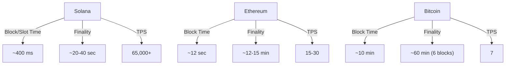

# Crypto & DeFi Terminology: PM's Glossary

**Reading Time:** ~25 minutes
**Audience:** Technical Product Managers (Solana-focused)
**Updated:** January 2026

---

## What's in this Document

This is a **comprehensive glossary and quick reference** for crypto and DeFi terminology:

- **Blockchain Basics**: Nodes, transactions, blocks, epochs, hashing, keys, and addresses
- **Consensus & Validation**: Mining, staking, slashing, attestation, delegation with Solana/Ethereum specifics
- **Token & Asset Terms**: Stablecoins, governance tokens, LSTs, RWAs, pegging/depegging mechanics
- **DeFi Mechanics**: AMMs, liquidity pools, yield & return mechanisms (6 types explained), lending, and money markets
- **Trading & Leverage**: Spot markets, derivatives, liquidation mechanics, funding rates with real October 2025 example ($19B liquidations)
- **MEV & Advanced Concepts**: Front-running, sandwich attacks, MEV-Burn, restaking, validator client diversity
- **Solana-Specific Terms**: PoH, slots, epochs, validators, Agave client, key DeFi protocols (Jupiter, Orca, Marinade, Drift)
- **Cross-Reference Guides**: Quick lookup by use case (building staking, trading, lending, wallet features)
- **Key Metrics**: Performance and economic comparison charts for Solana/Ethereum/Bitcoin

**What makes this useful**: Designed for fast lookup but with **proper context**. Every acronym is expanded on first use. Risk disclaimers included where relevant (e.g., depeg risk for LSTs, IL risk for LPs). No marketing language—just technical accuracy.

---

## Quick Acronym Reference

| Acronym | Expansion |
|---------|-----------|
| **AMM** | Automated Market Maker |
| **APY** | Annual Percentage Yield |
| **APR** | Annual Percentage Rate |
| **CEX** | Centralized Exchange |
| **DAO** | Decentralized Autonomous Organization |
| **DEX** | Decentralized Exchange |
| **IL** | Impermanent Loss |
| **LP** | Liquidity Provider |
| **LST** | Liquid Staking Token |
| **MACD** | Moving Average Convergence Divergence |
| **MEV** | Maximal Extractable Value |
| **PoH** | Proof of History |
| **PoS** | Proof of Stake |
| **PoW** | Proof of Work |
| **RSI** | Relative Strength Index |
| **TVL** | Total Value Locked |
| **VDF** | Verifiable Delay Function |
| **RPC** | Remote Procedure Call (blockchain API endpoint) |
| **BIP39** | Bitcoin Improvement Proposal 39 (seed phrase standard) |
| **HD** | Hierarchical Deterministic (key derivation standard) |
| **KYC** | Know Your Customer (identity verification) |

## Quick Navigation

- [Blockchain Basics](#blockchain-basics)
- [Consensus & Validation](#consensus--validation)
- [Token & Asset Terms](#token--asset-terms)
- [Wallets & Custody](#wallets--custody)
- [DeFi Mechanics](#defi-mechanics)
  - [Yield & Return Mechanisms](#yield--return-mechanisms)
- [NFT & Digital Assets](#nft--digital-assets)
- [Trading & Leverage](#trading--leverage)
- [MEV & Advanced Concepts](#mev--advanced-concepts)
- [Solana-Specific Terms](#solana-specific-terms)
- [Common Acronyms](#common-acronyms)

---

## Blockchain Basics

### Core Concepts

**Blockchain**
A distributed digital ledger that records transactions across many computers (nodes), with cryptographic links between blocks preventing tampering or deletion of past entries.

**Node**
A computer running blockchain software that maintains a copy of the entire ledger and validates new transactions. In Solana: ~1,295 nodes across 45+ countries.

**Transaction**
A request to move assets (crypto, NFTs, data) from one account to another, signed with the sender's private key and broadcast to the network for validation.

**Block**
A bundle of transactions added to the blockchain at a specific time, containing: transaction data, cryptographic hash (fingerprint), previous block's hash, and timestamp.

**Epoch**
A time period during which validators perform their duties. Ethereum: ~6.4 minutes (32 slots). Solana: ~2-3 days (~432,000 slots).

**Finality**
The point at which reverting a transaction would require economically irrational behavior by the network. Key distinction: finality ≠ block time. A transaction in a block doesn't mean it's final.

- **Bitcoin**: Probabilistic finality. Commonly assumed after ~6 blocks (~60 minutes). Each additional block reduces reorg probability.
- **Ethereum**: Economic finality via Casper FFG. ~12–15 minutes (2 epochs). Block inclusion at 12 seconds is NOT finality.
- **Solana**: Economic finality via stake-weighted voting. ~20–40 seconds. Slot time is 400ms, but finality requires network consensus.

**Confirmation**
Additional blocks or votes that increase confidence a transaction will not be reverted. On Bitcoin, each confirmation = one additional block mined on top of your transaction's block. On Solana, the term "confirmation" is imprecise; use "commitment level" instead.

- **Bitcoin**: Each confirmation ≈ 10 minutes (one additional block). 6 confirmations (~60 minutes) is the common safety standard. Security is probabilistic (more blocks = exponentially harder to revert).
- **Solana**: Does NOT use "confirmations" like Bitcoin. Instead uses "commitment levels": processed (~400ms, unreliable), confirmed (~1-2 seconds, stake-weighted supermajority, near-zero fork risk), and finalized (~10-20 seconds, absolute economic finality). Using "1 confirmation" for Solana is incorrect terminology.

**Commitment Level (Solana-specific)**
Solana's term for transaction state, replacing "confirmations" in traditional blockchain terminology. Three levels indicate increasing confidence:

1. **Processed** (~400ms): Transaction included in current block but not yet voted on. Risk: ~5% chance transaction drops if cluster forks.
2. **Confirmed** (~1-2 seconds): Block has been voted on by supermajority of stake-weighted validators (≥66%). Near-zero fork risk; no confirmed block has ever reverted in Solana's history.
3. **Finalized** (~10-20 seconds): Block has 32-slot lock-out (31+ additional confirmed blocks built on top). Absolute economic finality; reversal would require >33% of network stake colluding (economically irrational).

**Why the distinction matters**: Bitcoin's "6 confirmations" means sequential computational work. Solana's "finalized commitment level" means validator consensus + time lock. Different security models, not directly comparable. Always specify "commitment level" for Solana, not "confirmations."

### Cryptographic Concepts

**Hash/Hashing**
A one-way cryptographic function converting any input to a fixed-size string. Same input always produces identical output; changing one character completely changes the hash. Impossible to reverse. Used for transaction verification and block linkage.

**Private Key**
A secret number (typically 256-bit) that proves ownership and authorizes transactions. Equivalent to a password, but mathematically tied to your account address. If exposed: full account compromise.

**Public Key**
Derived from private key using elliptic curve mathematics. Visible to everyone and used to verify you authorized a transaction. Cannot be reversed to derive private key.

**Wallet Address / Account Address**
The public key (or hash of it), displayed as a long string. Equivalent to a bank account number. Everyone can see your address, but only you with the private key can move assets out.

Example Solana address: `9B5X32orMjHAGJjCjwuc9jVrKm86V5yc9` (truncated for example)

**Digital Signature**
Cryptographic proof you authorized a transaction, created using your private key. Anyone can verify the signature using your public key without needing your private key.

---

## Consensus & Validation

### Proof of Work (PoW)

**Mining**
The process where validators (miners) compete to solve complex cryptographic puzzles to propose new blocks and earn rewards. First to solve wins the block reward + transaction fees.

**Miner / Mining Pool**
Individual or group competing in mining. Solo miners compete alone; pool miners combine computing power and share rewards based on contribution.

**Hashrate**
Measure of computing power expressed in hashes per second (HPS). Bitcoin network: ~680 exahashes/second (2025). Indicates security (higher = harder to attack).

**Difficulty**
Parameter adjusting how hard the puzzle is. Increases as more miners join (to maintain ~10 minute blocks). Decreases if miners leave.

**Nonce (Number Used Once)**
A number miners iterate through while searching for a valid block hash. Trying different nonces until finding one that produces a hash meeting difficulty requirements.

**Block Reward**
New cryptocurrency created and given to the miner/validator who proposes a block. Bitcoin: 6.25 BTC (halves every 4 years). Solana: Declining inflation (~6-9% -> 1.5%).

### Proof of Stake (PoS)

**Validator / Staker**
Network participant who locks cryptocurrency (32 ETH, any amount of SOL) as collateral to propose and attest blocks, earning rewards for correct behavior and facing penalties (slashing) for misbehavior.

**Stake / Staking**
Locking cryptocurrency in a smart contract or validator account to earn rewards for validating transactions. Acts as collateral ensuring honest behavior.

**Slashing**
Penalty where a validator loses portion or all of their stake for rule violations (proposing multiple blocks, contradictory votes, etc.). Solana: 1-100% depending on severity. Ethereum: Up to 100%.

**Attestation**
Validator vote confirming a proposed block is valid. Ethereum validators attest every 12 seconds. Majority attestation finalizes the block.

**Delegation**
Process of entrusting your cryptocurrency to a validator to earn staking rewards without running validator infrastructure yourself. Validator doesn't control your funds; you retain full ownership. Common on Solana (any amount) and Ethereum (through pools).

**Validator Commission**
Fee validator takes from staking rewards. Solana market rate: 5-8%. Example: If validator earns 100 SOL in rewards, takes 6 SOL commission, delegators share 94 SOL.

---

## Token & Asset Terms

### Cryptocurrencies & Tokens

**Token**
Any on-chain digital asset: cryptocurrencies (Bitcoin, Ethereum, SOL), utility tokens (governance, access rights), NFTs, or fungible tokens representing real-world assets.

**Stablecoin**
Cryptocurrency designed to maintain stable value, typically pegged to fiat currency (USD). Used as safe store of value in volatile crypto markets and as base currency for trading/lending.

**USDC (Most Solflare-relevant example):**
USDC is a **fiat-backed stablecoin** issued by **Circle** (in partnership with Coinbase) representing a tokenized claim on real U.S. dollars held in reserve.

**How USDC works:**
1. **Minting**: Approved institutions deposit USD with Circle → Circle mints equivalent USDC → USDC enters circulation on blockchains (Ethereum, Solana, etc.)
2. **Reserves**: For every 1 USDC circulating, Circle holds ~1 USD equivalent in: cash at regulated banks or short-term U.S. Treasury bills (not crypto collateral).
3. **Redemption**: Approved institutions can redeem 1 USDC for 1 USD with Circle. This redemption right anchors the price. Retail users rely on markets, not direct redemption.

**Why the peg holds (incentive-based):**
- **If USDC drops below $1**: Traders buy cheap USDC, redeem for $1 with Circle, pocket the difference → buying pressure pushes price back to $1.
- **If USDC trades above $1**: Institutions mint new USDC, sell on market → selling pressure pushes price back to $1.

**Who enforces stability**: Circle (earns Treasury yield on reserves, business depends on trust), arbitrageurs (profit from peg deviations), and exchanges (rely on USDC for trading/settlement).

**What USDC is NOT**: ❌ Decentralized, ❌ censorship-resistant, ❌ trustless, ❌ protected like insured bank deposits. It is **programmable dollars**, not digital gold.

**Other stablecoins:**
- **USDT ($1 peg)**: Tether stablecoin, larger but more centralized and riskier.
- **DAI (variable)**: Decentralized stablecoin backed by overcollateralized crypto ($1.50 in ETH per $1 DAI), more experimental.

**Key mental model**: USDC works because real dollars back it and real money (arbitrage) enforces the peg. If redemption ever stops being real, the peg breaks fast.

**Pegging / Peg**
The act of maintaining a stable price relationship between a cryptocurrency and an external asset (usually USD). A $1 peg means 1 token = $1 market value. Three main mechanisms:

- **Fiat-backed (USDC model)**: Real USD reserves + redemption rights + arbitrage enforce peg (see USDC entry above for detailed mechanics)
- **Over-collateralization (DAI model)**: Backed by >$1.50 in crypto collateral per $1 DAI issued. Works only if collateral maintains value.
- **Algorithmic mechanisms (Luna UST—failed)**: Automated buying/selling to maintain price without collateral. Failed catastrophically when confidence broke.
- **Asset-backed (mSOL model)**: mSOL pegged to SOL value through Marinade's validator network. Works as long as staking continues.

**Real-world analogy:** Like a government maintaining a currency peg to gold or another currency. Works only with sufficient reserves and credibility.

**Depegging / Depeg**
Loss of the intended price relationship. When a token designed to be worth $1 drops below $1. Real examples:
- **stETH (Ethereum LST)**: Depegged to $0.93 in June 2022 during crypto market crash (recovered to ~$0.98-1.00 peg after stabilization)
- **UST (Luna stablecoin)**: Catastrophic depeg to $0.00 in May 2022 (collapsed from $1 → $0.30 → $0.00 in days)
- **USDC (Circle)**: Depegged to $0.88 in March 2023 during banking crisis uncertainty (recovered to $1.00 peg within days)

**Why depegging happens:**
1. **Loss of confidence** in backing (e.g., UST had no real collateral; UST collapsed immediately)
2. **Liquidity crisis** (not enough buyers at $1 price during market stress)
3. **Insolvency** (backing reserves depleted, can't honor redemptions)
4. **Smart contract exploits** (hacking the protocol)
5. **Market panic** (users rush to exit, creating selling pressure)
6. **Banking/regulatory risk** (for fiat-backed stablecoins like USDC: bank failures can temporarily freeze reserves, regulators can freeze addresses; see USDC March 2023 depeg after Silicon Valley Bank failure)
7. **Issuer risk** (for custodial stablecoins: company can be hacked, collapse, or lose credibility; USDC's March 2023 recovery was confidence-based, not guaranteed)

**Depeg severity levels:**
- **Temporary depeg** (recovers within hours/days): USDC March 2023
- **Prolonged depeg** (stays below peg for weeks/months): stETH June 2022
- **Permanent depeg** (never recovers): LUNA UST May 2022

**Why this matters for PMs:**
- **LST risk**: Liquid staking tokens (mSOL, stETH, JitoSOL) all carry depeg risk. Users should understand they're not 1:1 equivalent to underlying asset during market stress
- **User trust**: Depeg events destroy user confidence even if peg recovers. USDC lost market share to USDT after March 2023 depeg despite full recovery
- **Feature design**: If Solflare enables LST deposits, need clear risk communication about depeg scenarios
- **Collateral calculations**: Lending/derivatives protocols must haircut LST values (e.g., accept mSOL at $0.98 instead of $1.00) to account for depeg risk

**Distinction: Peg vs Market Price**
- **Peg**: Intended/designed price (USDC "pegged to $1")
- **Market price**: Actual trading price on exchanges (can diverge from peg)
- **Arbitrage opportunity**: If stETH trades at $0.95 but redeemable for $1 SOL eventually, traders buy low and profit when peg recovers

**Governance Token**
Token providing voting rights on protocol decisions. Examples: UNI (Uniswap governance), GMX (dYdX governance), JUP (Jupiter governance). Holders vote on feature changes, parameter adjustments, treasury allocation.

**Decentralized Autonomous Organization (DAO)**
A **group that runs a project using rules encoded in smart contracts**, where decisions are made by members (usually token holders) through on-chain voting instead of a traditional company hierarchy.

**"Autonomous" is a bit of a lie**—there are still humans and politics—but the **execution** can be automatic.

*What a DAO typically controls:*
- **Treasury**: Money held in crypto (shared ownership of protocol funds)
- **Protocol parameters**: Fees, staking rates, listing policies
- **Grants**: Funding teams and proposals
- **Contract upgrades**: Sometimes via timelock (delay before taking effect)

*How it works (simple flow):*
1. **Members hold voting power** (usually tokens, sometimes NFTs, sometimes reputation)
2. Someone **posts a proposal** ("Change fees from 0.3% to 0.2%" or "Fund this dev team")
3. Members **vote** (weighted by token holdings)
4. If it passes, it gets **executed** (either automatically via smart contract, or via multisig)

*Realistic example:*
A DeFi protocol DAO with $50M treasury. Proposal: "Use $2M to incentivize liquidity for 3 months." Votes pass. Smart contract automatically releases $2M over time. No CFO, no bank transfer needed.

*Why DAOs exist:*
- **Shared ownership**: Community has skin in the game
- **Transparent governance**: All proposals and votes are public, on-chain
- **Global coordination**: Anyone can participate (no geographic limits)
- **Programmable execution**: Rules can enforce outcomes automatically

*What can go wrong:*
- **Whale concentration**: Large token holders dominate votes (decentralized...ish)
- **Voter apathy**: Low participation means small group decides big money
- **Governance attacks**: Buy tokens → vote yourself funds
- **Slow decisions**: Voting and execution take time
- **"DAO theater"**: Reality check—it's often a small team with multisig control, not truly decentralized

*One-line mental model:*
A DAO is **a community-run company where voting and treasury actions happen on-chain** (or at least are publicly governed), instead of being controlled by a CEO and board.

**Utility Token**
Token providing access to protocol services. Example: SOL for Solana transaction fees and staking; ETH for Ethereum transaction fees; UNI for Uniswap interface access (no utility, only governance).

**Wrapped Token / Bridge Token**
Token representing an asset from another blockchain. Example: wETH (wrapped ETH on Solana), wBTC (Bitcoin represented on Ethereum). Creates liquidity between chains.

**Liquid Staking Token (LST)**
Derivative token representing staked cryptocurrency earning rewards. Deposit ETH → receive stETH (still earning 3.2% APY) → use stETH in DeFi while staking. Solana examples: mSOL, JitoSOL, stSOL.

**Collateral**
Assets locked in a smart contract as security for a loan or derivative position. If you fail to repay/maintain position, collateral is liquidated to cover losses.

### Real-World Assets (RWAs)

**Real-World Asset (RWA)**
Tokenized representation of off-chain assets: real estate, treasury bonds, commodities, corporate invoices, or stocks. Enables on-chain trading and settlement of traditional assets. Growing market: $850M on Solana (Jan 2026).

**Treasury Bonds Tokenized**
US government debt securities minted as on-chain tokens. Investors earn yield from bond interest while maintaining crypto market access. Regulated by SEC but custody/settlement on-chain.

**Tokenized Stocks**
Company equity shares minted on blockchain. Enables 24/7 trading (vs traditional 9:30-4:00 hours) and settlement in minutes (vs T+2 in traditional markets). Solana is largest chain by market cap for tokenized stocks.

---

## Wallets & Custody

### Core Concepts

**Wallet**
Software or hardware that holds private keys and manages cryptocurrency ownership. A wallet is an interface to the blockchain—it doesn't store crypto itself; it stores the keys that prove ownership. Think of it as a key manager, not a safe.

**Key distinction**: A wallet is NOT a bank account. You own the keys; you own the crypto. If you lose the keys, the crypto is gone forever (no password reset).

### Custodial vs Non-Custodial

**Custodial Wallet**
Third party (exchange, institution, or service) holds your private keys on your behalf. You access crypto through their app/platform, but they control the keys.

**Examples:**
- **Centralized exchanges**: Binance, Kraken, Coinbase (you hold coins on exchange)
- **Trading platforms**: Robinhood, eToro, Kraken
- **Custodial services**: PayPal, Square (limited crypto features)

**How it works:**
```
You send crypto → Exchange receives your crypto
Exchange stores your keys in their vault
You withdraw by requesting from exchange
Exchange transfers to your address
```

**Pros:**
- Easy to use (familiar UI like banking apps)
- No key management required (no lost keys)
- Customer support available
- Can freeze suspicious accounts (safety)

**Cons:**
- **Counterparty risk**: Exchange can be hacked (Mt. Gox lost $450M, FTX collapsed)
- **Regulatory risk**: Funds can be frozen by authorities or seized
- **Not your keys, not your coins**: You don't technically own the crypto until you withdraw
- **Lower yield**: Platforms take cut of staking/lending returns

---

**Non-Custodial Wallet**
You hold your own private keys. You control the crypto directly on the blockchain. No third party can prevent you from sending/receiving.

**Examples:**
- **Software wallets**: MetaMask, Phantom, Solflare, TrustWallet
- **Hardware wallets**: Ledger, Trezor, Coldcard
- **Browser wallets**: Brave wallet
- **Self-hosted**: Running your own node with full control

**How it works:**
```
You generate private keys (stored in your device/vault)
You sign transactions locally with your keys
You broadcast signed transaction to blockchain
Blockchain processes it without intermediary
```

**Pros:**
- **True ownership**: You control the keys, you control the funds
- **No counterparty risk**: No exchange can be hacked to steal your funds
- **Censorship-resistant**: No authority can freeze your account
- **Better yield**: Direct access to DeFi protocols
- **Composability**: Can use same keys across multiple dApps (DeFi, NFTs, staking)

**Cons:**
- **Key management burden**: You're responsible for backups
- **Loss is permanent**: Lose seed phrase = funds gone forever
- **User error risk**: Sending to wrong address, phishing, malware
- **Less support**: Wallets provide limited customer support
- **Slower onboarding**: More setup required

---

### Hardware Wallets

**Hardware Wallet**
Physical device (USB stick-like) that securely stores private keys offline. Keys never leave the device; you sign transactions on-device and broadcast signed data (not keys) to blockchain.

**Examples:**
- **Ledger** (most popular, 5M+ users)
- **Trezor** (strong privacy/open-source focus)
- **Coldcard** (Bitcoin-focused, highly secure)
- **Keystone** (air-gapped, no USB connection)

**How it works:**
```
1. You generate seed phrase on device (offline)
2. Seed phrase backed up (written on paper, stored safely)
3. Device stores private keys derived from seed
4. To transact: Connect device → Approve on device screen → Broadcast signed tx
5. Private keys NEVER leave the device
```

**Security model:**
- Keys stored in secure enclave (tamper-resistant chip)
- Signing happens on-device (malware on your computer can't steal keys)
- Display on device (verify transaction before signing, not relying on computer screen)
- Seed backup: If device breaks, recover with seed phrase on new device

**Pros:**
- **Highest security** (keys offline, signing isolated)
- **Works across multiple wallets**: Same seed works with MetaMask, Phantom, etc.
- **Long-term storage**: Ideal for "hodlers" (hold long-term)
- **No internet needed to store**: Can be air-gapped

**Cons:**
- **Cost**: $50-150 per device
- **UX friction**: Requires device connection and on-device confirmation each transaction
- **Seed backup risk**: Writing seed phrase on paper creates physical security risk
- **Device backup dependency**: If device breaks AND you lose seed phrase = funds gone

**Solana-specific hardware wallet support:**
- Ledger: ✓ Full support (most used)
- Trezor: ✓ Full support
- Keystone: ✓ Support via QR code (air-gapped)

---

### Software Wallets

**Software Wallet**
Private keys stored on your device (phone, computer, browser) as encrypted data. Keys live on same device as internet connection—security depends on device security.

**Types:**

**1. Browser Extension Wallets**
- Examples: MetaMask, Phantom, Solflare, TrustWallet
- Private keys stored encrypted in browser storage
- Sign transactions in popup when dApps request permission

**How it works:**
```
1. Create wallet → Private key generated locally → Stored encrypted in browser
2. Connect to dApp → dApp requests permission to send transaction
3. You review and approve in wallet popup
4. Wallet signs transaction locally
5. Signed transaction broadcast to blockchain
```

**Security:**
- ✓ Keys never leave your device
- ✓ dApp doesn't see private key (only gets signature)
- ❌ Keys stored on internet-connected device (vulnerable to malware)
- ❌ Browser extensions can be compromised

**Solana ecosystem (Phantom dominance):**
- **Phantom** (~15M users): Dominant Solana wallet
- **Solflare** (~4M users): #2 Solana wallet, focus on security (transaction preview, phishing detection)
- **TrustWallet**: Multi-chain, owned by Binance

**2. Mobile App Wallets**
- Examples: TrustWallet, Solflare Mobile, Phantom Mobile
- Private keys stored on phone's secure enclave (if available)
- More secure than computers (phones have stronger isolation)

**Security improvements over computers:**
- Phone OS isolates apps better than computer browsers
- Some phones (iPhone with Secure Enclave) store keys in tamper-resistant hardware
- Biometric auth (face/fingerprint) more convenient than passwords

**3. Cold Storage / Air-Gapped**
- Example: Paper wallet, Ledger (above)
- Keys never touch internet
- Maximum security, minimum convenience

---

### Self-Custody & Key Management

**Self-Custody**
You hold and control your own private keys. Full responsibility for security and backups.

**Key concepts:**

**Seed Phrase (Recovery Phrase, Mnemonic)**
12-24 human-readable words that mathematically encode your private key. Standard format: BIP39 (used by all major wallets).

**Example (fake):**
```
abandon ability able about above absolute absorb abstract abuse access accident
```

**Why it works:**
- Words derived from entropy (randomness)
- You can recreate the same private key from these words on any wallet
- If device breaks, import seed phrase into new wallet → same keys

**Security rule: NEVER share seed phrase. Seed phrase = full access to all funds.**

---

**Key Derivation (HD Wallets)**
From one seed phrase, you can generate unlimited addresses for unlimited cryptocurrencies.

**How it works:**
```
Seed phrase (BIP39)
  ↓
Master key
  ↓
Derivation path (m/44'/501'/0'/0')  [This means: Solana, account 0, address 0]
  ↓
Private key for that address
  ↓
Public key (address)
```

**Why this matters:**
- One seed phrase generates all your Solana addresses
- Same seed works on Bitcoin, Ethereum, Solana (if wallet supports it)
- Wallets can be recovered with just the seed phrase

---

**Hardware vs Software Seed Storage**

| Storage Method | Security | Recovery | Convenience | Cost |
|---|---|---|---|---|
| **Hardware wallet + paper seed** | ⭐⭐⭐⭐⭐ (keys offline) | ✓ (seed as backup) | ⭐ (device required) | $50-150 |
| **Software wallet (browser)** | ⭐⭐⭐ (keys on internet device) | ✓ (seed phrase backup) | ⭐⭐⭐⭐ (always available) | Free |
| **Software wallet (mobile)** | ⭐⭐⭐⭐ (phone isolation) | ✓ (seed phrase backup) | ⭐⭐⭐⭐⭐ (most convenient) | Free |
| **Paper wallet** | ⭐⭐⭐⭐⭐ (fully offline) | ✗ (fragile) | ⭐ (must type manually) | Free |
| **Centralized exchange** | ⭐⭐ (counterparty risk) | N/A (you don't own keys) | ⭐⭐⭐⭐⭐ (easiest) | Free (but fees) |

---

### Complete Custody Comparison

| Aspect | Custodial (CEX) | Software Wallet | Hardware Wallet |
|--------|---|---|---|
| **Key Control** | Exchange holds | You hold | You hold |
| **Owner Risk** | Hacks, freezing, collapse | Malware, phishing, lost seed | Lost device, lost seed |
| **Security Level** | Medium (professional security, but centralized target) | Good (keys isolated from signing) | Excellent (keys offline) |
| **Speed** | Instant (on exchange) | 1-3 seconds | 10-30 seconds (device interaction) |
| **Convenience** | Excellent (like banking app) | Very good (built-in dApp browser) | Good (but device required) |
| **DeFi Access** | Limited | Full access to all DeFi | Full access with device |
| **Cost** | Fees per transaction/trading | Free (except network gas) | $50-150 upfront |
| **Withdrawal Time** | Hours-days (requires KYC) | Seconds to minutes | Seconds to minutes |
| **Censorship Risk** | High (authority can freeze) | None (you control keys) | None (you control keys) |
| **Best For** | Day traders, beginners, fiat on/off | Active DeFi users, long-term holders | High-value holdings, maximum security |

---

### For Solflare Users (Positioning Context)

**Solflare as Software Wallet:**
- Non-custodial (you hold keys)
- Browser extension + mobile app
- Security features: Transaction preview, phishing detection (Stronghold), emergency pause
- DeFi-native: Direct Jupiter integration, staking, token swaps
- Card product: Fiat on-ramp (but maintains non-custodial model where possible)

**Solflare vs Phantom (competitive context):**
- Both: Non-custodial, browser + mobile
- Phantom: 15M users, broader multi-chain
- Solflare: 4M users, Solana-focused, security emphasis, Solflare Card

**When to recommend what:**
- **Beginner, wants simplicity**: Phantom or Solflare (browser wallet)
- **High security, rarely trades**: Hardware wallet (Ledger) + software wallet for active trading
- **Active trading, lots of transactions**: Software wallet (lower friction)
- **Long-term hold, paranoid**: Hardware wallet with paper seed backup

---

## DeFi Mechanics

### Automated Market Makers (AMM)

**AMM (Automated Market Maker)**
Smart contract pricing assets using mathematical formula (typically x × y = k) instead of traditional order books. Enables anyone to swap assets without counterparty risk. Examples: Uniswap, Orca, Raydium.

**Liquidity Pool / Pool**
Smart contract holding two or more assets in reserve. Traders exchange against the pool; pool adjusts price based on ratio changes. LPs deposit assets and earn swap fees.

**Liquidity Provider (LP)**
User depositing two assets into an AMM pool to earn trading fees. You provide equal value of both assets (e.g., 5 ETH + 10K USDC). Share of fees = your percentage of pool.

**Swap / Swap Fee**
Transaction where trader exchanges one token for another through AMM. Fee (0.01%-1%) collected from trader, distributed to LPs. Example: Swap 1 ETH for ~1,500 USDC, pay 0.3% fee (~4.50 USDC).

**Concentrated Liquidity**
Providing liquidity only within specific price range instead of across full spectrum. Dramatically increases capital efficiency: same $100K in 1,800-2,200 range generates 20x more fees than full-range allocation.

**Impermanent Loss (IL)**
Temporary loss from price divergence between deposit and withdrawal times. An AMM **forces you to automatically sell high and buy low** as price moves (due to constant product formula), reducing final value compared to just holding the tokens.

**Why it happens (the math):**
An AMM like Uniswap keeps reserves balanced: `token_A × token_B = constant`. If you deposit equal value (e.g., 5 SOL + $7,500 USDC) and SOL price doubles:
- Without LP: You'd have 5 SOL + $7,500 USDC = $17,500 total
- As LP: AMM forces you to sell SOL and buy USDC to rebalance → you end up with fewer SOL + more USDC = ~$17,000 total
- **Loss: ~$500** (the IL)

The loss grows with price divergence. 1.5x price move = ~2% IL. 2x move = ~5.6% IL. 4x move = ~20% IL.

**Real example:**
- You deposit $10K (5 SOL @ $1,000 + 5K USDC) into SOL/USDC pool
- SOL price jumps to $1,200 (20% move)
- IL = ~0.64% = $64 loss
- But trading fees earned that month = $200
- **Net profit = $136** (fees overcome IL)

**When IL matters:**
- ✅ Stable pairs (USDC/USDT): IL negligible, fees dominate → good yields
- ❌ Volatile pairs (SOL/USDC): High IL risk → need 50%+ fees to compensate
- ✅ Correlated pairs (stSOL/SOL): Low IL → good risk/reward

**When it's "impermanent":**
If price returns to entry, IL goes to zero (you get your tokens back, minus any liquidation/slippage fees). But if you withdraw at peak divergence, IL becomes permanent.

**One-line mental model:**
Being an LP is a **short volatility trade**—you profit from stable prices + fees, but lose if volatility spikes. The bigger the move, the bigger you lose.

**Capital Efficiency**
Ratio of fees generated per dollar deployed. Uniswap v2 full-range: 1x efficient. Uniswap v3 concentrated: 20-4000x efficient depending on range. Higher efficiency = more fees from same capital.

**Slippage**
Difference between expected execution price and actual execution price due to liquidity constraints. 1% slippage means you execute at 1% worse price than calculated. Large orders cause more slippage.

**Liquidity Depth**
Amount of liquidity available to absorb trades without significant price impact. Deep liquidity = small slippage on large orders. Thin liquidity = high slippage, wider spreads.

### Lending & Money Markets

**Money Market**
DeFi protocol enabling lending/borrowing. Users deposit collateral, receive interest on deposits; borrowers pay interest to borrow. Examples: Aave, Compound, Jupiter Lend.

**Lending Protocol**
Smart contract managing deposits, borrowing, and interest distribution. Typically uses pooled collateral (all deposits go to same pool). Examples: Aave ($10B+ TVL), Jupiter Lend ($1.65B TVL in Oct 2025).

**Interest Rate**
Return earned by lenders (deposit APY) and paid by borrowers (borrow APY). Algorithmic rates adjust based on supply/demand. High utilization → high rates → attracts more lenders.

**Liquidation (Lending)**
When a borrower's collateral value falls below the minimum threshold, the protocol **forcibly closes the position and sells the collateral** to repay the debt. Liquidators trigger the liquidation and receive a reward (typically 5-10%). The borrower loses the collateral amount.

**How it actually works (step by step):**

1. **You deposit collateral** (e.g., 100 SOL @ $100 = $10K)
2. **You borrow against it** (e.g., $5K USDC, leaving $5K buffer)
3. **Collateral value drops** (SOL falls to $90)
4. **Your position becomes risky** (collateral now $9K, debt $5K, buffer only $4K)
5. **Liquidators watch for this** (via smart contracts/bots)
6. **Liquidation triggered** (e.g., when buffer drops below 20%)
7. **Your SOL is sold** (all 100 SOL liquidated at ~$90 each = $9K)
8. **Debt is repaid** ($5K USDC returned to lenders)
9. **Liquidator takes cut** (e.g., $450 reward = 5% of collateral)
10. **You get leftovers** ($9K - $5K - $450 = $3,550 back, you lose $6,450)

**Real example (Jupiter Lend):**
- Deposit: 100 SOL ($10K @ $100)
- Borrow: $5,000 USDC against it
- Liquidation threshold: When your collateral drops below 120% of debt
  - Debt: $5,000
  - Min collateral needed: $5,000 × 1.2 = $6,000
- **Price drops to $60/SOL**
  - Your collateral: 100 SOL @ $60 = $6,000
  - **You're at liquidation threshold—liquidators will trigger**
- **Liquidation executes:**
  - Your 100 SOL sold for $6,000
  - Lenders repaid $5,000
  - Liquidator takes $300 (5%)
  - You get $700 back
  - **Loss: $9,300** (90% of original collateral gone)

**Why liquidation happens:**
- You're betting on price recovery, but price keeps falling
- Protocol needs to protect lenders (if SOL kept falling, lenders lose money)
- Incentive alignment: If you're underwater, liquidators profit by closing you out

**Cascade risk (the scary part):**
If many people are liquidated at once:
1. Large liquidations create selling pressure
2. Price falls further
3. More positions hit liquidation threshold
4. More forced sales
5. Price crashes harder

Real example: Aug 2023 Solana flash crash → $2B in liquidations across Aave/Jupiter/Marinade in hours.

**How to avoid it:**
- **Use low leverage** (borrow only 20-30% of collateral, not 80%)
- **Monitor health factor** (most protocols show a "health factor"; <1.5 = warning zone)
- **Use stop-loss** (close position before liquidation)
- **Diversify collateral** (don't put all in one volatile asset)

**One-line mental model:**
Liquidation is the **protocol's kill switch** to protect lenders when your collateral can't cover your debt. It's not punishment—it's financial triage.

**Isolation Mode**
New asset can only borrow against its own collateral until reaching liquidity threshold. Prevents cascading liquidations from low-liquidity assets. Used on Jupiter Lend for emerging tokens.

### DeFi Operations

**TVL (Total Value Locked)**
Sum of all cryptocurrency assets deposited in DeFi protocols. Used to measure protocol size/health. Solana TVL: $8-9B (Jan 2026). Higher TVL = larger, more mature protocol.

**Yield Farming**
Deploying capital in DeFi protocols to earn rewards. May combine multiple strategies: LP fees + token rewards, staking + lending, etc. Often incentivized during protocol launches.

**Composability / Money Legos**
Ability to combine multiple DeFi protocols. Example: Deposit ETH → Receive stETH → Deposit stETH to Lido LP pool → Deposit LP tokens to lending protocol → Borrow USDC against LP collateral. Each step compounds yield.

**Smart Contract**
A **self-executing program on the blockchain** that automatically enforces agreements when conditions are met. Code IS the contract—no lawyers, judges, or intermediaries needed. If condition X happens, then code does action Y automatically.

**Key difference from traditional code:**
- **Traditional software**: Code runs on a company's servers, can be changed/shut down anytime
- **Smart contracts**: Code runs on blockchain, **immutable once deployed**, cannot be deleted/changed (unless explicitly designed with upgrade mechanism)

**Real-world examples:**

*Example 1: Uniswap swap*
```
Condition: User sends 1 SOL
Then: Contract calculates USDC output using constant product formula
      Transfers USDC to user
      Transfers SOL to liquidity pool
      Updates pool reserves
Result: Atomic swap happens. No Uniswap employees involved.
```

*Example 2: Jupiter Lend*
```
Condition: User deposits 100 SOL
Then: Contract records deposit in state
      Calculates accruing interest
      Allows borrowing against collateral
      Daily: Updates interest rates based on utilization
Result: Lending happens automatically. Interest accrues without human action.
```

*Example 3: Drift prediction market settlement*
```
Condition: Event outcome is confirmed (via oracle)
Then: Contract checks all open positions
      Pays winners their profit
      Takes losses from losers
      Settles on-chain in one transaction
Result: Thousands of trades settle instantly, fairly, without dispute.
```

**Why smart contracts matter for DeFi:**
- **No trust needed** (code enforces rules, not promises)
- **24/7 operation** (no business hours, no holidays)
- **Transparency** (everyone can read the code)
- **Atomic execution** (all-or-nothing; no partial fills or reversals)
- **No intermediary rent** (fees go to LPs/network, not bankers)

**The scary part (risks):**
- **Code is law...but code can be buggy** (Ronin bridge hack: $625M stolen because of access control bug)
- **Immutable = unchangeable forever** (if there's a bug, you can't just patch it; you have to deploy new contract)
- **Complexity = hidden risks** (a contract with 10K lines of code might have exploits nobody noticed)
- **Oracle manipulation** (if price feed is fake, contract makes bad decisions)

**Real disaster example:**
The DAO hack (2016): $50M stolen because of a reentrancy bug in the code. Smart contract did exactly what the code said—but the code had a flaw that let attackers drain funds.

**Governance vs. Execution (the honest truth):**
Many "decentralized" protocols have smart contracts, BUT:
- Contracts can have "admin keys" (backdoor to change params)
- Contract upgrades still require governance (a DAO votes to change rules)
- If a bug is found, the DAO can pause/upgrade (it's not truly immutable)

Example: Solflare integrates Jupiter smart contracts, but Jupiter DAO can vote to upgrade the router. So it's "decentralized execution" with "DAO-controlled governance."

**One-line mental model:**
A smart contract is **code that runs on the blockchain and automatically executes deals**. It's like a vending machine—you put in money, code verifies the transaction, dispenses the item—no human involved.

**TVL Ratio**
Ratio of TVL to market cap. Solana DeFi TVL/$9B to SOL market cap/$77B = ~11.7% ratio. Higher ratio indicates healthy protocol growth relative to token valuation.

### Yield & Return Mechanisms

**Yield**
Return on capital earned by deploying cryptocurrency in DeFi protocols, expressed as percentage per year. **Analogy**: Like interest on a bank savings account, but decentralized and variable. Unlike traditional banking (1-5% APY), crypto yield ranges 3-1000%+ depending on risk and strategy.

**Key Distinction from Traditional Finance:**
- **Traditional savings account**: Bank holds your money, pays you 4% APY (guaranteed by deposit insurance)
- **Crypto staking**: You lock SOL with validators, earn 6-9% APY (rewards funded by protocol inflation)
- **Crypto LP yield**: You provide liquidity, earn 10-50%+ APY (from trading fees, no guarantee)

**Why Crypto Yields Are Higher:**
Crypto protocols are newer, riskier, and need to incentivize capital deployment to bootstrap liquidity. As protocols mature, yields typically decline (Ethereum staking fell from 10% to 3.2% as more capital arrived).

**Types of Yield in Crypto:**

**1. Staking Yield**
Return earned by validators or delegators for securing the network. Solana: 6-9% APY. Ethereum: 3.2% APY. Funded by protocol inflation (newly created tokens) + transaction fees. **Risk**: Slashing (losing stake for misbehavior), though rare for delegators.

**2. Liquidity Provider (LP) Yield**
Return from trading fees earned by providing liquidity to AMM pools. Calculated as: (trading fees earned per year / capital deployed) × 100.

**Example calculation:**
- You deposit $10K (5 SOL + $7,500 USDC) into SOL/USDC pool on Orca
- Daily volume in pool: $10M
- Swap fee: 0.25%
- Daily fees collected: $10M × 0.25% = $25K
- Your share (if you're 0.1% of pool): $25 per day
- Annual yield: $25 × 365 = $9,125 per $10K = **91% APY**

⚠️ **Critical disclaimer**: This assumes consistent $10M daily volume. Real-world volumes fluctuate. Also doesn't account for impermanent loss (IL). Realistic net APY after IL: 30-70%.

**3. Lending Yield**
Return earned by depositing cryptocurrency into lending protocols. Lenders earn interest from borrowers. Jupiter Lend: 8-15% APY on stablecoins, variable on volatile assets. **Risk**: Liquidation cascade (protocol insolvency from bad debt).

**4. Concentrated Liquidity Yield**
Advanced LP strategy providing liquidity only in specific price range. Dramatically increases capital efficiency and fee yield. Uniswap v3 example: $100K in tight 1,800-2,200 SOL/USDC range can generate **200-400% APY** (vs 20-40% full-range allocation).

**Risk**: IL concentrated into narrow range. If price moves outside range: you earn zero fees until price returns.

**5. Protocol Token Rewards**
New protocols incentivize users with governance tokens. Example: Jupiter Lend launch offered 10% APY stablecoin interest + 50% APY JUP token rewards = 60% total APY. **Risk**: Rewards token often crashes post-launch. 60% APY becomes 20% if token drops 60%.

**6. Composability Yield (Yield Farming)**
Combining multiple yield sources. Example:
- Deposit SOL → Receive mSOL (earn 6% staking)
- Deposit mSOL + SOL to Orca LP pool (earn 15% LP fees)
- Deposit LP tokens to lending protocol as collateral
- Borrow USDC against collateral (borrow 50% of value)
- Deploy USDC in Jupiter Lend (earn 10% lending yield)
- **Total blended yield**: 6% + 15% + 10% = 31% (simplified; actual calculation accounts for capital efficiency)

**Yield Metrics:**

**APY (Annual Percentage Yield)**
Return including compounding interest. If yield is paid daily and reinvested, APY compounds. Formula: APY = (1 + daily yield)^365 - 1. Example: 0.1% daily = (1.001)^365 - 1 = 44% APY (accounting for compounding).

**APR (Annual Percentage Rate)**
Return without compounding. Useful for comparing simple interest products. Example: 10% APR stablecoin lending paid monthly = slightly less than 10% APY (no compounding).

**Effective Yield**
Actual return after accounting for losses, fees, and variable factors. Effective yield of LP strategy = gross fees earned - impermanent loss - protocol fees (typically 10-25% of gross fees). Often 50-70% of advertised yield.

**Yield Variability by Risk:**

| Yield Type | Risk Level | Typical APY | Safety |
|------------|-----------|-----------|---------|
| **Solana staking** | Low | 6-9% | Slashing rare, protocol-backed |
| **Ethereum staking** | Low | 3.2% | Very safe, mature protocol |
| **Stablecoin lending** | Medium | 8-15% | Liquidation risk if collateral drops |
| **Token LP (volatile pair)** | High | 30-100%+ | Impermanent loss can exceed yield |
| **New protocol rewards** | Very High | 50-500%+ | Token often crashes, liquidity risk |

**Why Yield Matters for PMs:**
- **Feature differentiation**: Users choose wallets/platforms partly on yield offered. Solflare Card holders want yield on fiat-connected USDC.
- **Retention**: Yield compounds user lifetime value. 2% difference in APY = significant annual difference ($200 per $10K).
- **Risk communication**: PMs must clearly explain risks (IL, slashing, liquidation) since users often assume crypto yields are risk-free like banks.
- **Composability**: Smart wallet UIs could aggregate yield across protocols, showing "blended APY" for complex strategies.

---

## NFT & Digital Assets

### NFT Fundamentals

**NFT (Non-Fungible Token)**
Unique digital asset represented on blockchain where each token is distinct and cannot be exchanged 1:1 for an identical token. Unlike fungible tokens (1 SOL = 1 SOL), each NFT has unique properties, metadata, and ownership history. Examples: digital art, collectibles, gaming items, domain names, virtual real estate.

**Fungible vs Non-Fungible**
- **Fungible**: Interchangeable, identical value. 1 SOL = 1 SOL, same as currency.
- **Non-fungible**: Unique, not interchangeable. One digital artwork ≠ another artwork, even if both "artworks" by same creator. Each has distinct rarity/attributes.

**Blockchain Standard / Token Standard**
Specification defining how tokens work on-chain. **Solana standards:**
- **SPL Token**: Standard for fungible tokens (all cryptocurrencies)
- **SPL NFT**: Standard for non-fungible tokens (Metaplex standard, most Solana NFTs)
- **Compressed NFTs**: Space-efficient NFTs using state compression, enabling millions of NFTs
- **pNFT (Programmable NFT)**: NFTs with programmable royalty enforcement and transfer rules

**On-Chain Metadata**
Information attached to NFT defining its properties: name, description, image URL, attributes (rarity traits), creator info. Stored on blockchain or linked via URI (decentralized storage or IPFS).

**Off-Chain Data / IPFS**
Large NFT data (images, video) stored off-chain on IPFS (InterPlanetary File System), with only hash stored on-chain. Hash proves data integrity; if data matches hash, it's authentic. Prevents blockchain bloat.

**Smart Contract / NFT Contract**
Program managing NFT creation, ownership, and transfers. Examples on Solana: Metaplex program manages minting/selling; magic Eden contract manages marketplace transactions. Users interact with contract when minting, buying, or trading.

**Mint / Minting**
Process of creating new NFT. Minter (creator or authorized party) deploys contract, sets supply limit, uploads metadata, and mint is launched. First mint at 1 creates NFT #1.

**Collection**
Group of related NFTs sharing same contract/standard. Examples: "DeGods" collection (10K NFTs), "ABC NFT" series. Collections have supply limits (10K = max 10,000 mints), rarity tiers, and unified metadata structure.

**Royalty / Creator Fee / Secondary Royalty**
Percentage of sale price paid to original creator on secondary marketplace sales. NFT creator sets royalty (e.g., 5%), so every resale pays 5% back to creator. Solana standard: Metaplex enforces royalties on-chain. Example: $1,000 NFT sale with 5% royalty = $50 to creator.

**Royalty Enforcement**
Technology ensuring royalties are paid on resales. **Solana:** Metaplex program enforces via pNFT standard. **Challenge:** Non-enforced marketplaces ignore royalties (Magic Eden enforces, but LooksRare doesn't, causing creator loss). **PM implication:** Wallets should integrate royalty-enforcing marketplaces to build creator trust.

### NFT Ownership & Trading

**Wallet / Address Owner**
User who holds NFT private key. NFT ownership = private key access to wallet containing NFT. Non-custodial, irreversible ownership. Can prove ownership without revealing private key.

**Proof of Ownership**
Cryptographic proof you own NFT. When you sign transaction with private key, blockchain proves you authorized the transfer without exposing private key. Critical for wallets to verify ownership before showing NFT to user.

**Transfer / Transaction**
Moving NFT from one wallet to another. Signed by sender's private key, verified by network, recorded on blockchain. Irreversible once confirmed. Gas/fee required.

**Marketplace**
Platform where NFTs are bought/sold. Examples: Magic Eden (Solana leader, 90K+ NFTs), Solanart, Tensor (live streaming mechanics). Marketplace takes commission (typically 2%), creators get royalties, seller gets remainder.

**Listing / Unlisting**
**Listing**: Seller posts NFT on marketplace at specific price, signaling intent to sell. NFT remains in wallet; marketplace has permission to transfer if buyer purchases.
**Unlisting**: Seller removes listing, canceling sale intent. NFT remains in wallet, no transaction.

**Offer / Bid**
Buyer makes offer below asking price, seller can accept/decline. If accepted, transfer happens. Offers enable price discovery without forcing fixed-price sales.

**Floor Price**
Lowest asking price for NFT collection. Example: DeGods collection floor = 50 SOL means cheapest listed DeGod is 50 SOL. Used to gauge collection health/valuation.

**Rarity / Rarity Score**
Scoring system assigning value to NFT traits. Rarity tools (howrare.is, Magic Eden metadata) rank NFTs by attribute scarcity. Rare traits (e.g., "only 5 NFTs have diamond eyes") = higher rarity score = higher valuation. Drives trading activity.

**Wash Trading / Wash Sale**
Manipulative trading where same user buys/sells same NFT repeatedly to fake activity and inflate volume. Artificially inflates floor price. Detectable by blockchain analysis (same wallet buying/selling repeatedly). Against most marketplace ToS.

### NFT Standards & Technology

**ERC-721**
Ethereum's standard for non-fungible tokens. First widely-adopted NFT standard (2017). Defines transfer, ownership, metadata. Every NFT on Ethereum is ERC-721 compatible. Solana equivalent: SPL NFT.

**ERC-1155 / Semi-Fungible Token**
Ethereum standard enabling both fungible and non-fungible tokens in single contract. Used for gaming (combine identical weapons + unique armor in one contract). More efficient than separate ERC-721/ERC-20.

**Metaplex**
Solana's NFT infrastructure standard. Provides programs for minting, managing collections, enforcing royalties (pNFT), and metadata handling. Most Solana NFTs use Metaplex. Owned by Solana Foundation.

**Compressed NFT (cNFT)**
Space-efficient NFT using state compression. Traditional NFT on-chain = ~8KB storage; cNFT uses ~300 bytes via merkle tree compression. Enables billions of NFTs on Solana. Trade-off: slightly slower queries, reduced on-chain utility vs traditional NFTs.

**Token URI / Metadata URI**
Link to NFT metadata file (JSON) containing name, description, image URL, attributes. Example: `https://arweave.net/metadata/abc123.json`. Can point to IPFS, Arweave, or centralized server. If link dies, metadata becomes inaccessible (wallet can't display image).

**Decentralized Storage**
Services enabling censorship-resistant NFT data hosting. **IPFS**: Content-addressed, distributed file system. **Arweave**: Permanent storage service (pay once, store forever). **Solana Action URL**: Wallet-native storage via Blinks. Reduces reliance on centralized servers.

**Inscription / Text-based NFT**
NFT data inscribed directly on blockchain (Bitcoin Ordinals, Solana DAS). No off-chain storage needed; data permanently embedded. More expensive (larger transaction), but maximizes decentralization/permanence.

### NFT Use Cases

**Digital Art / Collectibles**
Original creators mint digital artwork as NFTs, enabling ownership transfer, resale, and royalty collection. Examples: Bored Ape Yacht Club (profile pics), Art Blocks (generative art), SuperRare (1-of-1 artworks).

**Gaming Assets / In-Game Items**
Games mint items as NFTs: weapons, armor, skins. Players own assets across games; if game shuts down, player still owns items. Enables player-driven markets and cross-game compatibility.

**Virtual Real Estate / Metaverse**
Digital land/property owned as NFTs. Example: Decentraland plots, Sandbox parcels. Landowners earn revenue from user activity (stores, events). Speculative asset if metaverse adoption grows.

**Ticketing / Event Access**
NFT tickets proving event attendance/access. Resalable on secondary market, creator gets royalties on each resale. Prevents counterfeiting (blockchain proves authenticity).

**Membership / Access Control**
NFT granting access to services, communities, or exclusive content. Example: BLUR NFT holders get trading fee discounts. Automatic verification via wallet ownership.

**Domain Names / Address Naming**
NFT-based domain (.sol on Solana, .eth on Ethereum). Replaces wallet addresses with human-readable names (alice.sol instead of 9B5X32...). Tradeable on secondary markets.

**Proof of Attendance / Social Status**
NFTs minting at events proving participation. POAP (Proof of Attendance Protocol) creates memory/credential. Non-transferable by default; builds reputation. Example: Conference attendee = NFT proving you attended.

**Fractional Ownership**
NFT split into fungible shares. Example: $1M painting → 1M shares (1 share = 0.001% ownership). Lowers entry price, enables broad ownership. Sellers get revenue from dividends/appreciation.

### NFT Market Dynamics

**Floor Sweep / Floor Mopping**
Buying all listed NFTs at floor price to accumulate collection or take market position. Also called "buying the floor."

**Rug Pull / Exit Scam**
Creator absconds with funds, abandons project, stops supporting community. NFTs become worthless. Legitimate projects: maintain roadmap, communicate transparently, maintain utility/royalties. High risk in new projects.

**Pump & Dump**
Manipulative scheme: insiders hype NFT collection, dump holdings once retail FOMO buys in, causing price collapse. Against marketplace ToS but difficult to prove/enforce on-chain. Community vigilance + transparency prevents this.

**Seasonality / Market Cycles**
NFT trading volume fluctuates with crypto sentiment (bull = high volume, bear = low volume). Typically 70% decline from peak to trough during bear markets. Affects creator revenue and secondary sales.

**Secondary Market Liquidity**
Ability to sell NFT quickly at reasonable price. High-floor collections (DeGods, Magic Eden Magic Tickets) = liquid. New/small collections = illiquid (no buyers, must wait/discount to sell). PM consideration: show liquidity indicators so users understand exit difficulty.

---

## Trading & Leverage

### Spot Trading

**Spot Market / Spot Trading**
Buying actual cryptocurrency for immediate delivery. You pay money, receive asset directly to your wallet. Opposite of futures/derivatives.

**CEX (Centralized Exchange)**
Traditional exchange where operators maintain order books and hold user funds. Examples: Binance, Kraken, Coinbase. Fast, liquid, but custodial (exchange holds your keys).

**DEX (Decentralized Exchange)**
Peer-to-peer exchange via smart contracts (AMM or order books) where you maintain self-custody. Examples: Uniswap, Jupiter, Orca. Non-custodial, slower than CEX, but no counterparty risk.

**CLOB (Central Limit Order Book)**
Traditional order matching system where buyers/sellers submit limit orders at specific prices. New innovation for blockchain: Hyperliquid achieved CEX-like speeds. Provides tighter spreads than AMMs.

**Bid-Ask Spread**
Difference between highest buy price (bid) and lowest sell price (ask). CEXs: 0.01-0.1% (tight). AMMs: 0.3-1% (wider). Tight spreads indicate liquid markets.

**Price Impact**
How much your trade moves the market price. Large orders in thin liquidity cause large impact. 10% price impact means execution at 10% worse price than spot rate.

**Market Order**
Buy/sell immediately at best available price. Used for speed. Typically executes with slippage on DEXs.

**Limit Order**
Buy/sell only at specific price or better. Waits for price target. If filled, execution price is guaranteed at or better than specified; but order may not fill immediately (or at all if price never reaches limit).

---

### Derivatives Trading

**Derivatives / Perpetual Futures**
Contracts representing asset price movements without owning the underlying asset. Enables speculation and hedging without capital requirements of spot trading.

**Perpetual Futures**
Derivative contract with no expiration date. Traders bet on future price direction with leverage. Funding rate mechanism keeps contract price near spot price. Examples: Drift, Hyperliquid.

**Leverage / Margin**
Trading with borrowed funds to amplify exposure. 5x leverage: Control $50K with $10K capital. Increases profit/loss potential proportionally.

**Long Position**
Bet that price will increase. Profit if price rises, loss if price falls. Example: 10x long SOL → profit $1K per 2% SOL price increase; lose $1K per 2% price decrease.

**Short Position**
Bet that price will decrease. Profit if price falls, loss if price rises. Borrow asset, sell high, buy back low. Risk: If price keeps rising, losses are unlimited.

**Liquidation (Derivatives)**
Forced position closure when collateral falls below maintenance margin. Liquidation price: where remaining capital equals zero. Liquidator receives reward (typically 5%). You lose all collateral.

**Maintenance Margin**
Minimum collateral percentage required to keep position open. Typically 5-10% of notional position. Falls below → liquidation triggered. Different from initial margin (required to open position, typically 25%).

**Liquidation Price / Liquidation Level**
Price at which position is force-closed. Example: 10x long at entry $100, liquidation margin 10% → liquidation at $91 (10% loss). Below $91 → liquidation.

**Funding Rate**
Periodic payment between long and short traders to keep perpetual futures price near spot. High funding rate: shorts paying longs (indicates over-leverage on longs). Negative funding: longs paying shorts.

**Leverage Liquidation Cascade**
Domino effect where liquidations trigger more liquidations:
1. Unexpected price move
2. Some positions fall below maintenance margin
3. Liquidations create selling pressure
4. More positions hit liquidation threshold
5. Cascade causes extreme volatility

Real example: October 10, 2025 liquidation of $19B in 24 hours.

**Basis / Basis Trading**
Strategy exploiting price difference between spot and futures markets. If futures trade above spot: buy spot, short futures, pocket the spread. Low-risk, scalp-style trading.

---

## MEV & Advanced Concepts

### MEV (Maximal Extractable Value)

**MEV (Maximal Extractable Value)**
**Value that validators can extract by controlling transaction order.** Validators see incoming transactions in the mempool (pending transactions), and can reorder them for profit before including them in blocks.

**The core problem:**
Validators choose which transactions go into a block and in what order. This creates an information advantage: they can see your pending swap, place their own transaction before it, then place another after—all to profit from the price impact YOU created.

**Why it happens:**
1. You submit a large swap (e.g., "buy 1M USDC worth of SOL")
2. Validator/MEV bot sees it in mempool
3. They know this will push price up
4. They front-run you (buy first), then you execute, then they sell
5. They profit from the gap between before/after prices
6. **You pay the cost** as worse execution price

**Real-world cost:**
- 2024: ~$10B+ in MEV extracted across all chains
- Ethereum alone: $5-7B annually
- Solana: Lower than Ethereum (different consensus model), but still billions annually
- Average user impact: 1-5% slippage on large trades (worse than market)

**How big is the impact?**
If you do a $100K swap and MEV extracts just 0.5% → you lose $500 vs fair execution. Over thousands of users, it adds up to billions.

**Front-Running**
Validator sees your incoming transaction and places a transaction **before it** to profit from the price movement you'll cause. Then your transaction executes at worse price.

*Simple example:*
1. You want to buy 100 SOL (pushing price up)
2. Validator buys 10 SOL first (cheap)
3. Your 100 SOL buy executes, pushing price higher
4. Validator's 10 SOL is now worth more
5. Validator sells for profit

**The honest take:** In traditional finance, this is market manipulation and **illegal**. In crypto, it's built into consensus design—validators are incentivized to maximize extraction. It's not cheating; it's the system working as designed (badly).

**Sandwich Attack**
Validator places transaction **before AND after** your transaction to capture the full spread.

*Detailed example:*
1. Victim: wants to swap 10 ETH for USDC (large order, will move price)
2. Validator step 1 (front-run): buys 1 ETH (cheap, before victim's order)
3. Victim executes: swaps 10 ETH for USDC at worse price than fair (price moved up due to validator's purchase)
4. Validator step 2 (back-run): sells their 1 ETH for USDC at the new higher price
5. **Result:** Validator profits $X, victim loses $X
6. This happens in **one atomic block**, so victim might not even notice until settlement

This is called a "sandwich" because the validator's transactions wrap around the victim's.

**Back-Running**
Placing a transaction **after** a target transaction to capture resulting price movement.

*Example:*
1. Liquidation happens (forced sell of $10M SOL)
2. Validator sees the liquidation tx
3. Liquidation executes, pushing SOL price down
4. Validator immediately buys cheap SOL
5. Price recovers slightly
6. Validator sells at profit

Or: Validator sees a large arb trade succeed, immediately copies it to capture remaining inefficiency.

**MEV-Burn / PBS (Proposer-Builder Separation)**
Attempts to reduce MEV extraction:
- **MEV-Burn**: Validators must burn (destroy) extracted MEV instead of keeping it. Reduces incentive to extract. Used on some Solana proposals.
- **PBS**: Separate "builder" (constructs blocks with txs) from "proposer" (validates/submits blocks). Builders can't order transactions; reduces validator MEV access.

**Flashbots**
Encrypted transaction pool allowing users to hide pending transactions until confirmed. Reduces front-running risk by making pending orders invisible to validators.

**Solana's advantage (Proof of History):**
Solana's PoH pre-commits transaction order via timestamp cryptography. Validators can't reorder—sequence is determined by PoH, not validator choice. This **dramatically reduces MEV** compared to Ethereum.

Cost of MEV on Solana: ~$50-100M/year. Cost on Ethereum: ~$5-7B/year. The architectural difference matters.

**One-line mental model:**
MEV is the **hidden tax validators extract from traders** by controlling transaction order. It's not theft—it's how current blockchain design lets validators capture value. Fixing it requires architectural changes (PoH, PBS, encryption).

### Advanced Staking

**Restaking**
Staking already-staked assets to earn additional rewards. Example: Stake ETH → receive stETH → restake stETH to earn additional yield. Emerging on Ethereum; creates compounding opportunities.

**MEV Rewards Redistribution**
Some liquid staking protocols (JitoSOL) capture MEV generated by their validators and distribute to stakers. Can add 1-3% APY on top of base staking rewards.

**Validator Client Diversity**
Different software implementations of consensus mechanism. Ethereum: Prysm (37%), Lighthouse (37%), Teku (16%), Nimbus (10%). Solana: Agave (92%), Firedancer (upcoming). Client diversity prevents single-point-of-failure bugs.

---

## Solana-Specific Terms

### Solana Architecture

**Proof of History (PoH)**
Solana's cryptographic clock creating tamper-proof transaction ordering. Each transaction timestamped with verifiable delay function (VDF), creating sequential proof without external consensus. Enables 400ms block times and 65K+ TPS.

**Verifiable Delay Function (VDF)**
Cryptographic function requiring significant computational effort (~4B SHA-256 hashes per slot) but verifiable in milliseconds. Prevents pre-computation of timestamps. Core to PoH.

**Slot**
400-millisecond time window. Each slot, one validator (leader) proposes block. If leader goes offline, network skips slot (no missing blocks, just empty slots). ~432,000 slots per epoch (~2-3 days).

**Epoch**
Time period (2-3 days) during which staking rewards are calculated and distributed. New validators can activate, delegations change. Stake changes activate at next epoch.

**Leader / Leader Rotation**
Validator selected to propose block in assigned slot. Leader schedule published in advance. 400 slots per leader per epoch (~26 seconds of block production per validator per day).

**Tower Byzantine Fault Tolerance (Tower BFT)**
Solana's consensus mechanism combining PoH with optimized voting. Validators build on longest chain with valid PoH, achieving rapid finality (~20-40 seconds for economic finality) via stake-weighted voting without requiring separate explicit voting rounds.

**Directed Stake**
Marinade feature allowing stakers to direct their stake to specific validators instead of using automatic distribution. Enables users to support validators they prefer.

### Solana Tokens & Accounts

**SOL**
Native Solana token used for:
- Transaction fees (0.00005 SOL per simple transaction)
- Staking rewards
- Protocol inflation

**mSOL (Marinade SOL)**
Liquid staking token representing 1 SOL staked with Marinade protocol. Earns ~6-9% APY while being tradeable/usable in DeFi. Market leader in Solana liquid staking.

**JitoSOL**
Jito Network's liquid staking token combining base staking rewards (6-9%) plus MEV rewards (1-3%), totaling 7-12% APY. Includes MEV reward redistribution.

**Stake Account**
Solana account type holding delegated SOL. Separate from main wallet (non-custodial). Contains:
- Delegated SOL amount
- Delegation target (validator)
- Activation epoch
- Deactivation epoch

**Program / Smart Contract**
Solana terminology for smart contracts. Called "Programs" to emphasize they're executable code on-chain. Examples: Marinade program manages liquid staking logic.

**Lamport / SOL Units**
1 SOL = 1,000,000,000 Lamports (smallest unit). Analogous to cents/dollars. Used internally for precise calculations.

### Solana Validator Ecosystem

**Validator**
Network participant running Solana software (Agave client, Firedancer), validating transactions, proposing blocks, earning rewards, delegating validator commission.

**Validator Commission**
Fee validator takes from staking rewards. Market rate: 5-8%. Example: 100 SOL rewards pool → validator takes 6 SOL, delegators share 94 SOL. Users compare commissions when choosing validators.

**Agave Client**
Official Solana validator software implementation. Dominates Solana validator ecosystem: 92% of validators use Agave (as of Jan 2026). Open-source, maintained by Solana Foundation.

**Firedancer**
Jump Crypto's high-performance Solana validator client. Target: 65K TPS standard. Already achieved 1M TPS in testing. Expected to replace Agave as validator standard.

**Validator Onboarding**
Process of becoming Solana validator:
1. Acquire hardware (~$10-50K)
2. Stake SOL or accumulate delegations
3. Run Agave/Firedancer client
4. Participate in consensus
5. Accumulate delegations over time (quality validators attract more stake)

**Delegator**
User staking SOL to a validator without running validator infrastructure. Trusts validator to behave honestly. Retains full ownership/control of SOL.

**Nakamoto Coefficient**
Measure of network decentralization: minimum number of validators needed to control 51% of stake. Solana: 20 (higher = more decentralized). Ethereum: 6 (less decentralized). Bitcoin: ~100 (highly decentralized).

### Solana DeFi Protocols

**Jupiter**
Dominant DEX aggregator on Solana. Routes swaps across multiple liquidity pools to find best prices. Recently launched Jupiter Lend (fastest-growing money market in DeFi history: $500M TVL in 24 hours).

**Orca**
AMM protocol known for concentrated liquidity and fair price discovery. Pioneered "Whirlpools" (Uniswap v3-equivalent concentrated liquidity) on Solana.

**Raydium**
Automated market maker with strong community support. Provides baseline liquidity for many Solana tokens. Community-driven governance.

**Marinade**
Dominant liquid staking protocol on Solana. 3.1M+ directed stake TVL. Enables staking with any amount, mSOL exchangeable on DEXs.

**Drift Protocol**
Prediction markets and derivatives platform. Enables leveraged trading on Solana. Growing presence in perpetual futures vertical.

**Magic Eden**
Largest NFT marketplace, expanding into DEX/trading features. Building multi-vertical presence: NFTs, tokens, trading.

---

## Common Acronyms

| Acronym | Expansion | Context |
|---------|-----------|---------|
| **AMM** | Automated Market Maker | DEX protocol using mathematical formula for pricing |
| **APY** | Annual Percentage Yield | Return including compounding interest |
| **APR** | Annual Percentage Rate | Return without compounding |
| **AURA** | Aurora (alternative) | Alternative consensus mechanism |
| **DAO** | Decentralized Autonomous Organization | Member-controlled organization run by smart contracts |
| **dApp** | Decentralized Application | Software running on blockchain |
| **DEX** | Decentralized Exchange | Peer-to-peer exchange via smart contracts |
| **CFT** | Capture The Flag | Security competition; CTF not cryptocurrency term |
| **CEX** | Centralized Exchange | Traditional exchange: Binance, Kraken, Coinbase |
| **CLOB** | Central Limit Order Book | Traditional order matching system |
| **GM** | Good Morning | Common greeting in crypto Twitter |
| **GN** | Good Night | Common sign-off in crypto Twitter |
| **IL** | Impermanent Loss | Temporary loss from LP exposure to price divergence |
| **LP** | Liquidity Provider | User depositing assets in AMM pool |
| **LST** | Liquid Staking Token | Token representing staked position (stETH, mSOL) |
| **MEV** | Maximal Extractable Value | Value validators extract by reordering transactions |
| **MiCA** | Markets in Crypto-Assets Regulation | EU crypto regulation framework |
| **NFT** | Non-Fungible Token | Unique digital asset on blockchain |
| **NFA** | Not Financial Advice | Legal disclaimer in crypto community |
| **pNFT** | Programmable NFT | NFT with enforced royalties and transfer rules |
| **cNFT** | Compressed NFT | Space-efficient NFT using state compression |
| **POAP** | Proof of Attendance Protocol | Non-transferable NFT proving event attendance |
| **RWA** | Real-World Asset | Tokenized traditional assets (bonds, stocks, real estate) |
| **TVL** | Total Value Locked | Sum of all assets in DeFi protocols |
| **TPS** | Transactions Per Second | Network throughput |
| **VDF** | Verifiable Delay Function | Cryptographic function in Solana's PoH |
| **PoW** | Proof of Work | Bitcoin's consensus mechanism |
| **PoS** | Proof of Stake | Ethereum's consensus mechanism |
| **PoH** | Proof of History | Solana's consensus mechanism |
| **PBS** | Proposer-Builder Separation | MEV mitigation strategy |

---

## Cross-Reference: Terms by Use Case

### For PMs Building Staking Features
**Key Terms:** Validator, Staking, Stake Account, Delegation, Slashing, Commission, Liquid Staking Token (LST), mSOL, JitoSOL, APY, Epoch, Nakamoto Coefficient

### For PMs Building Trading Features
**Key Terms:** DEX, CEX, Swap, Slippage, Liquidity Pool, Market Order, Limit Order, Bid-Ask Spread, Price Impact, TVL, CLOB

### For PMs Building Lending/Yield Features
**Key Terms:** Yield, APY, APR, Staking Yield, LP Yield, Lending Yield, Concentrated Liquidity Yield, Protocol Token Rewards, Yield Farming, Effective Yield, Peg, Depeg, Money Market, Lending Protocol, Collateral, Interest Rate, Liquidation, Isolation Mode, TVL, Composability

**Why peg/depeg matters:** Liquid staking tokens (LSTs) and stablecoins carry depeg risk. Lending protocols must haircut LST collateral values, and users need risk disclosure about depeg scenarios.

### For PMs Building Wallet Features
**Key Terms:** Wallet, Custodial, Non-Custodial, Self-Custody, Hardware Wallet, Software Wallet, Private Key, Public Key, Wallet Address, Seed Phrase, Digital Signature, Smart Contract, dApp, CEX, DEX, MEV, Stablecoin, Peg, Depeg, Liquid Staking Token (LST)

**Why custody models matter:**
- **Custodial (CEX)**: Easier onboarding, but centralized risk (hacks, freezing, collapse). Good for beginners/traders.
- **Non-custodial (software wallet)**: Users control keys, true ownership, DeFi access. Need key management education.
- **Hardware wallet**: Maximum security but UX friction. Needed for high-value holdings.

**Why peg/depeg matters:** Users hold stablecoins and LSTs; wallet should display prices accurately and warn of depeg risk if user's holdings experience significant deviations from intended peg.

**Wallet-specific considerations:**
- **Key backup**: Must educate users on seed phrase importance and secure storage
- **Transaction verification**: Show clear transaction details before signing (prevent phishing)
- **Biometric security**: Use fingerprint/face ID instead of passwords for better UX/security
- **Recovery UX**: Make seed phrase import process obvious for returning users

### For PMs Building NFT Features
**Key Terms:** NFT, Fungible vs Non-Fungible, Minting, Collection, Marketplace, Listing, Floor Price, Rarity, Royalty, Royalty Enforcement, Proof of Ownership, Transfer, ERC-721, Metaplex, pNFT, Compressed NFT, Token URI, Decentralized Storage

**Why NFTs matter for wallets:**
- **Display & ownership proof**: Wallets must correctly display NFTs and prove user ownership via cryptography
- **Trading integration**: Direct marketplace integration reduces friction (no leaving wallet to trade)
- **Royalty transparency**: Users should see which marketplaces enforce creator royalties (build creator trust)
- **Metadata reliability**: If metadata URLs break, wallet should handle gracefully (show placeholder, warn user)
- **Gas fees**: NFT transfers cost gas like any transaction; clear fee disclosure prevents surprises

### For PMs Understanding Solana Specifically
**Key Terms:** Proof of History, Slot, Epoch, Leader, Validator, mSOL, JitoSOL, Jupiter, Orca, Marinade, Agave, Firedancer, TPS, Nakamoto Coefficient, Metaplex, SPL NFT, Compressed NFT, pNFT

---

## Key Metrics Reference

### Performance Metrics

**⚠️ IMPORTANT: Block Time vs Finality**

Don't confuse these:
- **Block time**: How long until transaction appears in a block
- **Finality**: How long until transaction is economically irreversible

A transaction in a block is NOT final (can be reorg'd).



**Key takeaway:** Solana's slot time (400ms) is faster, but actual finality (~20-40s) is comparable to Ethereum's economic finality speed (~60-90s for practical safety), though both are much faster than Bitcoin's probabilistic finality (60 minutes).

### Economic Metrics (January 2026)

| Metric | Solana | Ethereum | Bitcoin |
|--------|--------|----------|---------|
| **Staking APY** | 6-9% | 3.2% | N/A |
| **Validators** | ~800 | 1M+ | ~100K+ |
| **Min. Stake** | Any amount | 32 ETH | Any amount |
| **Annual Energy** | ~0.01 TWh | ~0.01 TWh | **211.58 TWh** (21,000x more) |
| **TVL (DeFi)** | $8-9B | $50B+ | N/A |
| **Tx Fee (avg)** | ~$0.00025 | ~$2-50 | ~$1-10 |

---

## Quick Reference: The "Why" Behind Terms

### Why is MEV Extraction Important?
Because validators can profit by reordering transactions, creating economic incentive for dishonesty. Understanding MEV helps product teams avoid user losses.

### Why Impermanent Loss?
Because AMM formula forces LPs to sell high/buy low as prices move, potentially reducing returns vs holding. Critical UX consideration for LP features.

### Why Slashing?
Because validators need economic incentive to behave correctly. Penalty for misbehavior provides strong disincentive against dishonesty, supporting network security without requiring centralized governance.

### Why Liquid Staking Tokens?
Because users want yield AND liquidity. LSTs unlock capital productivity (earn staking rewards while using assets in DeFi), driving adoption.

### Why Solana's PoH?
Because faster confirmation times enable retail applications (real-time trading, payments, gaming). Critical for UX/speed moat vs other chains.

---

## Learning Path Recommendations

**Week 1: Fundamentals**
1. Blockchain Basics section
2. Consensus & Validation section
3. Solana-Specific Terms section

**Week 2: Trading & Yield**
1. DeFi Mechanics section
2. Trading & Leverage section
3. Cross-reference: Terms by Use Case

**Week 3: Advanced**
1. MEV & Advanced Concepts section
2. Solana Validator Ecosystem section
3. Key Metrics Reference section

---

**Sources:**
- Solana Foundation: [solana.com/staking](https://solana.com/staking)
- Ethereum Documentation: [ethereum.org/staking](https://ethereum.org/staking)
- Uniswap v3: [docs.uniswap.org](https://docs.uniswap.org)
- CoinGecko Glossary: [coingecko.com/learn](https://www.coingecko.com/learn)
- Solana Ecosystem Reports: [blog.quicknode.com](https://blog.quicknode.com)

---

**Last Updated:** January 13, 2026
**Version:** 1.0
