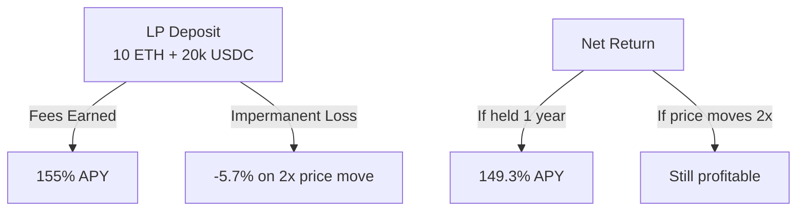
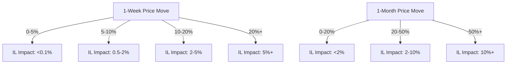
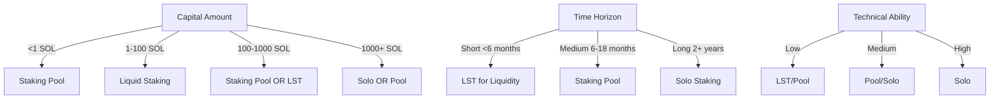
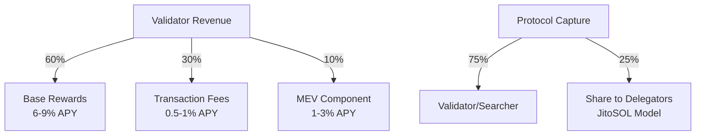
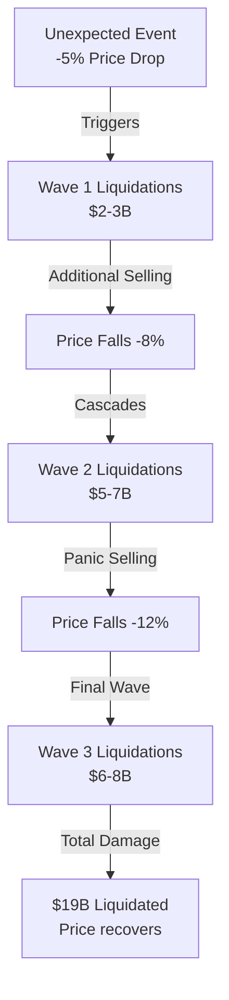
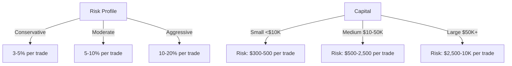
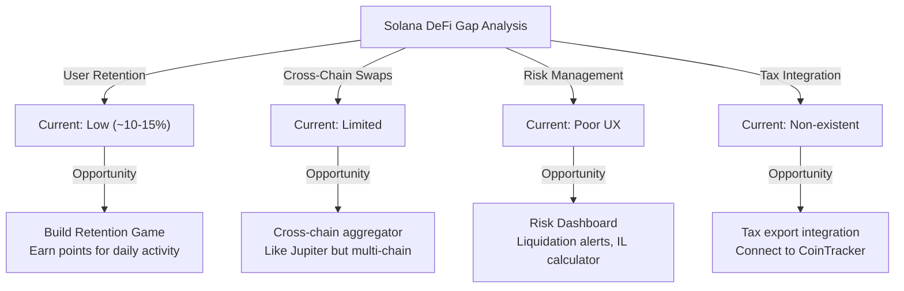

# DeFi Activities & Strategies: Deep Dive

**Reading Time:** ~35 minutes
**Audience:** Technical Product Managers
**Updated:** January 2026

---

## What's in this Document

This guide explores **practical DeFi activities and strategies** with real numbers and risk analysis:

- **Liquidity Providing Strategies**: How LP economics work (capital efficiency, fee yields), concentrated liquidity benefits (4000x possible), and IL (impermanent loss) risk calculations
- **Staking & Yield Strategies**: Native staking (6-9% Solana, 3.2% Ethereum), liquid staking mechanics (mSOL, stETH, JitoSOL), composite yield strategies combining staking + DeFi
- **Trading Strategies**: Spot trading setup, technical indicators (RSI, MACD, ATR), risk/reward ratios, and position sizing frameworks
- **Leverage & Derivatives**: Perpetual futures mechanics, leverage ratios, liquidation price calculations with real October 2025 $19B liquidation cascade example, funding rates
- **Risk Management**: Stop losses, position sizing, portfolio allocation, volatility hedging, and risk/reward calculations
- **Solana-Specific Opportunities**: Jupiter DEX aggregator, Orca concentrated liquidity, Drift derivatives, Marinade's validator direction features

**What makes this useful**: **Real numbers, not theoretical maximums**. Shows actual APY calculations (91% gross LP yield example), explains why it's lower net after IL (~30-70% realistic). Includes failure scenarios and risk disclaimers. Every strategy has a risk section explaining what can go wrong.

**Philosophy**: "Here's what you *could* earn, here's what can break it, here's how to monitor it."

---

## Quick Acronym Reference

| Acronym | Expansion |
|---------|-----------|
| **AMM** | Automated Market Maker |
| **APY** | Annual Percentage Yield |
| **ATR** | Average True Range |
| **CEX** | Centralized Exchange |
| **DEX** | Decentralized Exchange |
| **IL** | Impermanent Loss |
| **IRR** | Internal Rate of Return |
| **LP** | Liquidity Provider |
| **LST** | Liquid Staking Token |
| **MACD** | Moving Average Convergence Divergence |
| **MEV** | Maximal Extractable Value |
| **RSI** | Relative Strength Index |
| **TVL** | Total Value Locked |

## Table of Contents

1. [Liquidity Providing Strategies](#liquidity-providing-strategies)
2. [Staking & Yield Strategies](#staking--yield-strategies)
3. [Trading Strategies](#trading-strategies)
4. [Leverage & Derivatives](#leverage--derivatives)
5. [Risk Management](#risk-management)
6. [Solana-Specific Opportunities](#solana-specific-opportunities)

---

## Liquidity Providing Strategies

### LP Economics 101

#### The Basic Model

**You Deposit:**
- 10 ETH (~$20,000)
- 15,000 USDC (~$15,000)
- Total: ~$35,000 in equal value

**Pool Metrics:**
- You own: 0.5% of total pool (example)
- Pool fees: 0.3% per swap
- Daily volume: $10M swapped through your pool

**Daily Revenue (in high-volume conditions):**
- Swap volume: $10M
- Fee collected: $10M × 0.3% = $30,000
- Your share: $30,000 × 0.5% = $150/day
- Monthly: ~$4,500
- **Annual: ~$54,500 on $35K capital = 155% APY**

⚠️ **Important disclaimer**: This 155% APY assumes consistent $10M daily volume indefinitely. Real-world volumes fluctuate seasonally and vary by market conditions. Realistic APY expectations: 30-80% depending on market cycle, competition for liquidity, and volatility.

#### But There's a Catch: Impermanent Loss

**Scenario:**
- Entry: 1 ETH = $2,000, 1 USDC = $1
- Your deposit: 10 ETH + 20,000 USDC

- Price moves: 1 ETH = $4,000
- Pool rebalances to maintain x × y = k
- At withdrawal: You receive ~7.07 ETH + 28,284 USDC
  - Value: 7.07 × $4,000 + 28,284 × $1 = $56,568
  - If held: 10 × $4,000 + 20,000 × $1 = $60,000
  - **IL Loss: $3,432 (5.7% of position)**

**But:** If you earned $54,500 annually, IL is covered by fees in 22 days.



### AMM Versions: v2 vs v3 vs v4

#### Uniswap v2: Full-Range Liquidity

**How It Works:**
Liquidity spread across entire price range from $0 to infinity. Anyone depositing gets same capital efficiency.

**Capital Efficiency:**
- Theoretical efficiency: 1x (baseline)
- Practical efficiency: Low (most capital unused)

**Pros:**
- Simple to understand
- No management needed
- IL mitigated by consistent fees

**Cons:**
- Low returns per capital deployed
- Requires higher volume to break even on IL

**Best For:**
- Volatile token pairs
- Passive LPs (set and forget)
- LPs without active rebalancing capability

#### Uniswap v3: Concentrated Liquidity

**How It Works:**
You specify price range (e.g., 1,800-2,200 USDC per ETH). All capital deployed only when price in that range.

**Capital Efficiency Examples:**
- Stablecoin (USDC/USDT, 0.99-1.01 range): **4,000x**
- ETH/USDC (1,800-2,200 range): **20x**
- SOL/USDC (150-250 range): **8x**
- Full range: **1x** (equivalent to v2)

**APY Examples (Real 2025 Data):**

| Pair | Range | Efficiency | Annual APY |
|------|-------|-----------|-----------|
| USDC/USDT | 0.99-1.01 | 4000x | 10-20% |
| ETH/USDC | 1,800-2,200 | 20x | 15-25% |
| SOL/USDC | 150-250 | 8x | 12-18% |
| Altcoin/USDC | Custom | 100x+ | 50%+ |

**Pros:**
- Dramatically higher fees
- Capital efficiency enables Pareto returns
- Can adjust ranges to market conditions

**Cons:**
- Liquidation risk (if price exits range, earn zero fees)
- Active management required
- Higher gas costs for rebalancing

**Management Requirements:**
- Monitor price daily
- Rebalance weekly/monthly as price moves
- Potential gas costs: $50-500 per rebalance
- Optimized via automation tools

**Best For:**
- Stablecoin pairs (predictable ranges)
- Active LPs with capital to manage
- High-volume pairs (fees exceed gas costs)
- Sophisticated investors/DAOs

#### Uniswap v4: Custom Fees & Advanced Features

**What's New:**
- Custom fee tiers (vs fixed 4 options: 0.01%, 0.05%, 0.3%, 1%)
- Pool creators define fee structures
- Lower network costs for both LPs and traders

**Practical Impact:**
- Reduced transaction costs
- More granular fee discovery
- Greater composability with DeFi

**Example:**
- ETH/USDC pair could have 0.15% fee (vs choosing between 0.05% or 0.3%)
- Lower fees attract volume (more swaps)
- More swaps = more fees despite lower rate

**Status (January 2026):** Recent launch, adoption growing.

### Liquidity Providing Risk Analysis

#### Impermanent Loss Probability

**Scenario Analysis:**



**Mitigation Strategy:**
- **High-fee pairs**: Collect fees quickly to offset IL
- **Stablecoins**: Minimal price movement = minimal IL
- **Large LPs**: Spread across multiple positions to reduce concentration risk
- **Rebalancing**: Active adjustment to market price

#### Smart Contract Risk

**Considerations:**
- Audit status of protocol (Uniswap: Multiple professional audits)
- Bug history (Uniswap v3: Generally stable post-launch)
- Insurance availability (Nexus Mutual, InsureAce)
- Protocol upgrade risk

**Mitigation:**
- Use established protocols (Uniswap, Orca, Raydium)
- Start with small amounts
- Diversify across multiple protocols
- Check audit reports and bug bounties

#### Liquidation Risk for v3

**When It Occurs:**
If position becomes underwater and liquidation mechanism triggered (protocol-specific).

**Mitigation:**
- Monitor price constantly
- Rebalance before price exits range
- Set alerts at range boundaries
- Use automation tools (Poseidon, Orca Whirlpools automation)

### Solana LP Opportunities (January 2026)

#### High-Volume Pairs

**Best LP Opportunities:**
1. **SOL/USDC**: $1-2B daily volume
   - Efficiency: 8x (150-250 range)
   - APY: 12-18% realistic

2. **USDC/USDT**: Emerging stablecoin pair
   - Efficiency: 4000x (0.99-1.01)
   - APY: 10-20% sustainable

3. **mSOL/SOL**: Liquid staking arbitrage
   - Efficiency: Varies (price oscillates 0.98-1.02)
   - APY: 15-30% (includes mSOL yield)

4. **JUP/USDC**: Governance token
   - Efficiency: Moderate
   - APY: 30-50% (rewards included)

#### Platform Options

**Orca (Solana Native):**
- Whirlpools: v3-equivalent concentrated liquidity
- User experience: Optimized for Solana speed/costs
- Automation: Native rebalancing tools
- Current TVL: ~$300-500M

**Jupiter DEX:**
- Aggregator with integrated liquidity pools
- Recent launch of LPs
- Integration with Jupiter Lend
- Growing liquidity

**Raydium (Community-Driven):**
- Established AMM on Solana
- AcceleRaytor launchpad integration
- Community governance
- High volume on emerging tokens

---

## Staking & Yield Strategies

### Solo Staking: When It Makes Sense

#### Capital Requirements

**Total Cost:**
- Hardware: $500-$2,000
- SOL deposit (any amount, but 100-500 SOL recommended for efficiency): $15,000-$75,000
- Operating costs: $50-200/month (electricity, internet)

**When Viable:**
- Capital: >500 SOL (~$75K+)
- Technical skill: Moderate (Linux comfort required)
- Long-term: 2+ year commitment
- Availability: 24/7 uptime needed

**IRR Analysis:**
- Annual yield: 6-9% on SOL, minus:
  - Commission to validator: 0-100% (market rate: 5-8%)
  - Operating costs: $600-2,400/year
- Net yield: 5.5-8.5% on capital
- Breakeven period: 2-3 years with good validation

**Risk Profile:**
- Slashing risk: Low if infrastructure stable
- Opportunity cost: Capital locked (future unlock expected)
- Technical risk: Client software bugs, hardware failure

#### Best Practices

1. **Infrastructure:**
   - Use quality server hardware or colocation
   - Redundant internet connections
   - Monitoring and alerting (Sensu, Prometheus)
   - Automated failover if possible

2. **Client Diversity:**
   - Run Agave client (92% adoption, battle-tested)
   - Monitor Firedancer (emerging alternative)
   - Avoid single-client dependency

3. **Commission Strategy:**
   - Start low (0-3%) to attract delegators
   - Gradually increase as validators build reputation
   - Market rate: 5-8%

4. **Reputation:**
   - Monitor performance metrics (uptime, skip rate)
   - Participate in community (Discord, Telegram)
   - Regular infrastructure upgrades

### Staking Pools: Accessible Staking

#### Leading Protocols

**Marinade Finance:**
- **TVL**: $3.1M+ directed stake (2025)
- **Yield**: 6-9% base + directed stake benefits
- **Token**: mSOL (liquid staking token)
- **Fee**: 5% validator commission from rewards
- **Features**:
  - Instant unstaking (for fee)
  - Directed stake (choose validators)
  - DAO governance

**Jito Network:**
- **TVL**: Growing, significant in 2025
- **Yield**: 6-9% base + MEV rewards (1-3%)
- **Token**: JitoSOL
- **Total APY**: 7-12% (best yields on Solana)
- **Features**:
  - MEV reward redistribution
  - Searchable MEV (transparency)
  - Block builder integration

**Others:**
- **dzSOL** (Dropzone)
- **bnSOL** (Binance Staked SOL)

#### Strategy Selection

**Choose Based On:**



### Liquid Staking Token Strategies

#### Capital Deployment

**Scenario: $100K Deployment**

**Option 1: Direct Staking**
- Stake $100K in Marinade
- Receive $100K mSOL
- Locked in staking (no liquidity)
- APY: 6-9%
- Annual return: $6-9K

**Option 2: Liquid Staking + DeFi**
- Stake $100K → receive $100K mSOL
- Deposit mSOL to Jupiter Lend (borrow against it)
- Borrow $70K USDC at 8% interest
- Earn staking (6-9%) - pay interest (8%) = **net loss of 1-2% on mSOL component**
- BUT: This loss is offset if the borrowed capital earns enough elsewhere
  - LP in SOL/USDC: +15% APY on $70K = $10,500
  - Interest paid: $70K × 8% = $5,600
  - Net annual return: $6,500 (staking) + $10,500 (LP) - $5,600 (interest) = **$11.4K (11.4% total)**
  - Still profitable because LP yield (15%) exceeds borrowing cost (8%)

**Option 3: Concentrated LST Strategy**
- Stake $100K → mSOL
- LP in mSOL/SOL pair (concentrated liquidity, tight range like 0.98-1.02)
- Earn mSOL staking (6%) + LP fees (15-30%)
- **Total APY potential: 21-36%**
- **Realistic APY after IL**: 15-25% (IL from mSOL/SOL basis movements typically reduces gross returns by 5-15%)
- Risk: Significant IL from mSOL/SOL basis oscillations; requires active rebalancing to manage

**Comparison:**
| Strategy | Annual Return | APY | Complexity | Risk |
|----------|---------------|-----|-----------|------|
| Direct | $6-9K | 6-9% | Low | Low |
| LST + Borrow | $5.6-8K + strategy | Variable | High | Medium |
| LST + LP | $15-36K | 15-36% | High | Medium-High |

#### LST Selection Criteria

**mSOL (Marinade):**
- Market leader (largest TVL)
- Liquid market (tight spreads)
- Directed stake feature
- Best for: Conservative, long-term holders

**JitoSOL (Jito):**
- Highest yields (MEV inclusion)
- Growing adoption
- Smaller liquidity (wider spreads)
- Best for: Yield-maximizers, technical users

**bnSOL (Binance):**
- Centralized custody (counterparty risk)
- Stable yield
- Easy access for Binance users
- Best for: CEX-native users

### MEV Rewards: The New Frontier

#### Understanding MEV in Staking

**Traditional Staking:**
- Validators earn: Base rewards + transaction fees
- 2025 baseline: 6-9% APY

**MEV-Aware Staking:**
- Validators (searchers) find profitable transactions
- Propose blocks including profitable MEV transactions
- Share MEV rewards with delegators

**MEV Opportunity Size:**
- Solana validator revenue: $56.9M all-time high (Jan 2025)
- MEV component: ~20-30% of total in bull markets
- **MEV-only returns: 1-3% APY**

**MEV Distribution:**



**Jito Network Advantage:**
- Redistributes MEV to stakers
- Adds 1-3% to baseline yield
- **Total: 7-12% APY for JitoSOL holders**

#### MEV Strategies for LPs & Traders

**For LPs:**
- Provide liquidity in high-MEV pairs (large volume, volatile)
- MEV extraction can exceed base LP fees in bull markets
- Risk: Sandwich attacks reduce your returns

**For Traders:**
- Use MEV protection tools (Jito Bundles, MEV-Burn)
- Route through Flashbots
- Accept higher slippage for protection

---

## Trading Strategies

### Spot Trading: Buy & Hold vs Active Trading

#### Buy & Hold Investors

**Strategy:**
- Research projects (fundamentals, team, tokenomics)
- Purchase through CEX or DEX
- Hold for 6+ months (long-term conviction)
- Sell when thesis changes

**Expected Return:**
- Beta to SOL: -20% to +300% annually (depending on market cycle)
- Diversified portfolio: 0-50% annually (realistic)

**Risks:**
- Market downturns (entire portfolio falls)
- Project failure (team abandons, exploit occurs)
- Liquidity risk (small cap tokens hard to exit)

#### Active Traders (Swing Trading)

**Strategy:**
- Identify 3-7 day trading opportunities
- Buy support levels, sell resistance
- 5-10 trades monthly
- Technical analysis: moving averages, RSI (Relative Strength Index), MACD (Moving Average Convergence Divergence)

**Expected Return:**
- Skilled traders: 50-100% annually
- Average traders: -10-20% annually (trading costs exceed gains)
- Beginners: -30-50% annually

**Challenges:**
- Requires constant monitoring
- Emotional discipline (sell losers, hold winners)
- Gas fees/trading costs reduce returns
- Market timing is hard

#### Capital-Efficient Trading: Using Leverage

**Strategy (Risky):**
- 5x leverage on $10K = $50K exposure
- Identify high-probability swing trade
- Earn amplified returns

**Example:**
- SOL rises 10% in 7 days
- Without leverage: $10K → $11K (+$1K)
- With 5x: $10K → $15K (+$5K)
- Return: +50% in 1 week

**But The Downside:**
- SOL falls ~10%: Your $10K capital becomes $0 (liquidated)
  - 5x leverage means 1% price move = 5% capital loss
  - 10% price drop = 50% capital loss = liquidation at maintenance margin (~10%)
- Each additional 1% drop after liquidation threshold triggers forced closure
- Highly risky for inexperienced traders (liquidation happens faster than expected)

### DEX vs CEX: When to Use Each

#### Centralized Exchanges (CEX)

**Use When:**
- Onboarding from fiat (fastest)
- Need maximum liquidity (tightest spreads)
- Large trades (institutional size)
- Want custodial simplicity

**Examples:**
- Binance: Largest, most liquid, institutional
- Kraken: Regulated, US-focused
- Coinbase: Most retail-friendly, educational

**Trade-offs:**
- Must trust exchange with private keys (custodial)
- Subject to account freezes, compliance holds
- Hours of operation (markets 24/7 but support not)

#### Decentralized Exchanges (DEX)

**Use When:**
- Want non-custodial trading (self-custody)
- Trading low-liquidity/emerging tokens
- Prefer decentralized principles
- Value privacy/censorship-resistance

**Examples:**
- Jupiter: Best prices through aggregation
- Orca: Concentrated liquidity, great UX
- Raydium: Community-driven, good volume

**Trade-offs:**
- Lower liquidity = higher slippage on large orders
- Slower execution (blockchain speeds)
- Gas fees + exchange fees
- UI complexity for inexperienced users

#### Hybrid Strategy

**Optimal Approach:**
1. **Fiat → Stablecoin**: Use CEX (Kraken, Coinbase)
2. **Stablecoin → Altcoins**: Use DEX (Jupiter, Orca)
3. **Exit → Fiat**: Use CEX (Kraken, Coinbase)

**Result:** Access CEX liquidity for on/off ramps, DEX efficiency for trading.

### Trading Volumes & Metrics (2025)

#### Daily Spot Trading Activity

**Solana DeFi:**
- Daily volume: $3-4B
- 7-day users: 18.28M (+23% YoY)
- Transactions: 453.5M (+17% YoY)
- Peak platform: Meteora ($2.07B daily, $12.3B weekly)

**Ethereum DeFi:**
- Daily volume: $8-12B (larger than Solana)
- More mature protocols (Uniswap dominates)

**Bitcoin:**
- Daily volume: $30-50B (largest asset)

#### Market Share Shifts (2025)

- Solana DEX volume exceeded Ethereum DEX in peak periods
- Jupiter emerged as top aggregator
- Emerging tokens see fastest growth on Solana

---

## Leverage & Derivatives

### Perpetual Futures 101

#### Basic Structure

**Setup:**
- Deposit $10,000 USDC collateral
- Open 5x long SOL perpetual
- Control $50,000 SOL notional exposure

**Mechanics:**
- SOL rises 2%: Your profit = $50K × 2% = $1,000 (10% return on $10K)
- SOL falls 2%: Your loss = $50K × 2% = $1,000 (10% loss on $10K)

**Liquidation:**
- Maintenance margin requirement: 10% ($5,000)
- SOL falls 3%: You lose $1,500
- Collateral drops to $8,500 (still above $5K threshold)
- SOL falls 5%: You lose $2,500
- Collateral drops to $7,500 (still safe)
- SOL falls 10%: You lose $5,000
- Collateral drops to $5,000 (at liquidation threshold)
- **Any further loss → liquidation triggered**

#### Funding Rate Mechanism

**Purpose:**
Keep futures price aligned with spot price. Prevents arbitrage opportunities from causing price divergence.

**Mechanics:**
- **Positive funding:** Longs pay shorts (indicates over-leverage on longs)
- **Negative funding:** Shorts pay longs (indicates over-leverage on shorts)
- **8-hour intervals:** Funding exchanged every 8 hours

**Interpretation:**
- High positive funding: Market is over-leveraged long
  - Opportunity: Short the bounce
  - Risk: Squeeze/liquidation if longs forced to cover
- High negative funding: Market is over-leveraged short
  - Opportunity: Go long recovery
  - Risk: Shorts covering creates rally

**2025 Example:**
- October 2025: Positive funding rates reached 0.05% per 8 hours
- Annualized: 0.05% × 365/8 ≈ 2.28% monthly
- Indicates: Massive over-leverage on longs
- What happened: Price crash, $19B liquidations

### Risk Profiles by Leverage

#### Conservative: 2x Leverage

```
Liquidation Price Drop: 50%
Realistic Scenarios:
- Can survive 1-2 day corrections
- Suitable for: Long-term positions
- Annual P&L if right: ±50-100%
- Annual P&L if wrong: ±50-100%
```

#### Moderate: 5x Leverage

```
Liquidation Price Drop: 20%
Realistic Scenarios:
- Can survive 1-2 weekly corrections
- Suitable for: Swing trades (3-7 day)
- Annual P&L if right: ±250-500%
- Annual P&L if wrong: ±250-500%
```

#### Aggressive: 10x Leverage

```
Liquidation Price Drop: 10%
Realistic Scenarios:
- Very risky, liquidates easily
- Suitable for: Short-term trades only
- Annual P&L if right: ±1000%+
- Annual P&L if wrong: ±100% (total loss)
```

#### Extreme: 20x+ Leverage

```
Liquidation Price Drop: 5%
Realistic Scenarios:
- Liquidation likely (any adverse move)
- Suitable for: Scalping/bots only
- Annual P&L if right: ±10,000%+
- Annual P&L if wrong: ±100% (total loss + cascading)
```

### Liquidation Cascade Risk (October 2025 Example)

#### The Event

**October 10, 2025:**
- $19 billion in crypto leverage liquidated in 24 hours
- Long liquidations: $16.7B (ratio: 6.7:1 vs shorts)
- Interpretation: Retail massively over-leveraged on long side

**Trigger:**
- Unexpected price movement (could be macro news, technical breakdown, whale selling)
- Over-leveraged longs hit liquidation threshold
- Liquidations add selling pressure
- More longs fall below maintenance margin
- Cascade effect amplifies losses

#### Cascade Mechanics



**Key Insight:**
Single 5% move cascaded into 12%+ price movement due to liquidation waterfall.

#### Protecting Against Cascades

**Strategies:**
1. **Lower leverage**: 2x instead of 5x = survive larger moves
2. **Wider stops**: Close position if down 8% (before liquidation)
3. **Reduced position size**: Don't deploy all capital
4. **Diversification**: Reduce correlation (don't all go long)
5. **Monitoring**: Liquidation heatmaps, alert at maintenance margin

### Solana Perpetuals Platforms (2025)

#### Drift Protocol

**Features:**
- Native Solana perpetuals
- Concentrated liquidity AMM for funding
- Growing adoption
- Institutional grade

**Risks:**
- Relatively new (less battle-tested than centralized alternatives)
- Lower liquidity than centralized exchanges
- Smart contract risk

#### Hyperliquid (Cross-Chain)

**Features:**
- CLOB (Central Limit Order Book) model
- Sub-second execution
- CEX-like spreads and liquidity
- Decentralized but high-performance

**Risks:**
- Emerging platform (regulatory scrutiny possible)
- Cross-chain complexity

---

## Risk Management

### Position Sizing

#### Kelly Criterion Approach

**Formula:**
Position size = (Win % × Average Win - Loss % × Average Loss) / Average Win

**Example:**
- Win rate: 55% (win 55%, lose 45%)
- Average win: +5% return
- Average loss: -5% return
- Kelly = (0.55 × 5 - 0.45 × 5) / 5 = (2.75 - 2.25) / 5 = 0.1 (10%)

**Interpretation:**
- Allocate 10% per trade (conservative approach: use 50% of Kelly = 5%)
- Allows maximum growth while surviving drawdowns

#### Common Position Sizes



### Stop-Loss Discipline

#### Why Stop-Losses Matter

**Scenario: Without Stop-Loss**
- Position down 10%
- Hope for recovery
- Continues falling to -30%
- Eventually: forced liquidation or total loss

**Scenario: With Stop-Loss at -8%**
- Position hits stop at -8% loss
- Exit and live to trade another day
- Capital preserved for recovery

#### Placement Strategies

**Technical Support/Resistance:**
- Identify key support level (where price has bounced before)
- Place stop 3-5% below support (avoids whipsaws)
- Move stop higher as price rises (trailing stop)

**Volatility-Based:**
- Calculate average true range (ATR) for asset
- Set stop at 2x ATR below entry
- Allows normal volatility while protecting against cascades

**Time-Based:**
- Hold position only for intended timeframe (3-7 days, etc.)
- Exit automatically if target not hit in time
- Prevents capital lock-up in non-performing positions

### Portfolio Rebalancing

#### Annual Rebalancing

**Process:**
1. Define target allocation (60% Solana, 20% Ethereum, 20% Stablecoins, for example)
2. Calculate current allocation
3. Rebalance to targets (buy underweights, sell overweights)

**Benefits:**
- Locks in gains (sell high performers)
- Buys dips (accumulates underperformers)
- Maintains risk profile

**Tax Considerations:**
- Each rebalance is taxable event in most jurisdictions
- Consider tax-loss harvesting (sell losers to offset gains)
- Coordinate with accountant

#### Dynamic Rebalancing

**Market-Triggered Rebalancing:**
- Rebalance when allocation deviates 5%+ from target
- More responsive to market movements
- Requires more activity (higher fees)

**Example:**
- Target: 50% SOL, 50% USDC
- Current: 55% SOL, 45% USDC (5% deviation)
- Action: Sell 2.5% of SOL, buy USDC to restore 50/50

---

## Solana-Specific Opportunities

### Capital Efficiency Stacking

#### Multi-Layer Yield Strategy

**Layer 1: Base Staking**
- Deposit SOL with Marinade
- Receive mSOL
- Earn 6-9% base yield

**Layer 2: Liquid Staking LP**
- Deposit mSOL to mSOL/SOL LP
- Earn 15-30% LP fees
- Plus continue earning mSOL yield (6%)
- Total: 21-36% APY

**Layer 3: MEV Rewards (Optional)**
- Use JitoSOL instead of mSOL
- Earn 7-12% staking (includes MEV)
- LP in JitoSOL/SOL
- Total: 22-37% APY

**Capital Deployed:**
```
$100,000 Deployed:
- Layer 1 return: $7,000 (7% average)
- Layer 2 return: $21,000 (21% LP)
- Layer 3 return: $3,000 (3% MEV premium)
- Total annual: $31,000 (31% APY)
```

#### Risk Considerations

- **Smart contract risk**: Multiple protocols = multiple risk vectors
- **IL risk**: LP exposure to mSOL/SOL basis
- **Liquidation risk**: If borrowing against positions
- **Complexity**: Many moving parts, high monitoring needed

### Solana's Speed Moat: Applications

#### Real-Time Trading Features

**Current Limitations (Other Chains):**
- Ethereum: 12-second block times (slow for active trading)
- Bitcoin: 10-minute confirmation (unusable for retail)

**Solana Advantage (400ms Finality):**
- Real-time order books (price updates every 400ms)
- Enables mobile app trading (responsive UI)
- Suitable for casual traders (not just professionals)

**Product Implications:**
- Solflare can build real-time DEX features
- Enable gamified trading (predict next 1-minute movement)
- Offer real-time notifications without stale data

#### Retail-Focused Applications

**Opportunities:**
1. **Mobile-first trading**: Solana's speed enables smooth mobile UX
2. **Payment features**: Point-of-sale integration (instant settlement)
3. **Staking UX**: Quick delegation, fast unstaking
4. **Yield farming dashboard**: Real-time APY calculations

### Market Gaps on Solana (2025)

#### Identified Opportunities



#### Competitive Analysis

| Gap | Solflare Position | Competitor | Opportunity |
|-----|------------------|-----------|-------------|
| **Retention** | None current | Phantom badge system | Gamification layer |
| **Staking UX** | Not launched | Jupiter Lend auto-stake | Integrated staking widget |
| **Risk Tools** | None | None (market gap) | Liquidation alerts + IL calc |
| **Mobile** | Web-based | Phantom mobile | True mobile-first DEX |

---

## Key Metrics Dashboard

### Personal Portfolio Health Metrics

Track these weekly:

| Metric | Healthy Range | Action Trigger |
|--------|---------------|-----------------|
| **Sharpe Ratio** | >1.0 | <0.5 = rethink strategy |
| **Drawdown** | -10% to -20% | >-30% = reduce leverage |
| **Win Rate** | >50% | <45% = revisit trade setup |
| **Profit Factor** | >1.5 | <1.0 = exit all trades |
| **Slippage Cost** | <0.3% | >0.5% = adjust order sizes |

### Protocol Health Metrics

Track these for protocols you use:

| Metric | Solana DeFi | Ethereum DeFi | Trend |
|--------|------------|--------------|-------|
| **TVL** | $8-9B | $50B+ | Solana growing |
| **Daily Volume** | $3-4B | $8-12B | Solana catching up |
| **User Count** | 18.28M | 15M+ | Solana > Ethereum |
| **Avg Tx Cost** | $0.00025 | $2-50 | Solana << Ethereum |
| **Finality** | 400ms | 12sec | Solana >> Ethereum |

---

## Summary: Strategy Selection by Profile

### Conservative Investor
**Recommendation:**
- Stablecoin LP (v3 concentrated): 10-20% APY
- Solo staking (if capital >1K SOL): 5.5-8.5%
- Dollar-cost averaging into SOL

### Moderate Investor
**Recommendation:**
- 60% liquid staking (mSOL): 6-9%
- 40% concentrated LP (SOL/USDC): 15-25%
- Blended APY: 9-15%

### Aggressive Investor
**Recommendation:**
- Multi-layer yield (staking + LP + MEV): 20-36% APY
- Swing trading on spot: 50-100% annual (if skilled)
- Small leverage position: 10-20% of capital at 3-5x

### Yield Maximizer
**Recommendation:**
- JitoSOL (MEV staking): 7-12%
- mSOL/SOL LP: 20-30%
- Jupiter Lend (borrow and deploy): +3-5%
- Total: 30-47% APY (high risk)

---

**Sources:**
- Orca Finance: [orca.so](https://orca.so)
- Marinade: [marinade.finance](https://marinade.finance)
- Jupiter: [jup.ag](https://jup.ag)
- Drift: [drift.trade](https://drift.trade)
- DefiLlama: [defillama.com](https://defillama.com)
- FTI Consulting: [Oct 2025 Liquidation Report](https://www.fticonsulting.com/)

---

**Last Updated:** January 13, 2026
**Version:** 1.0
